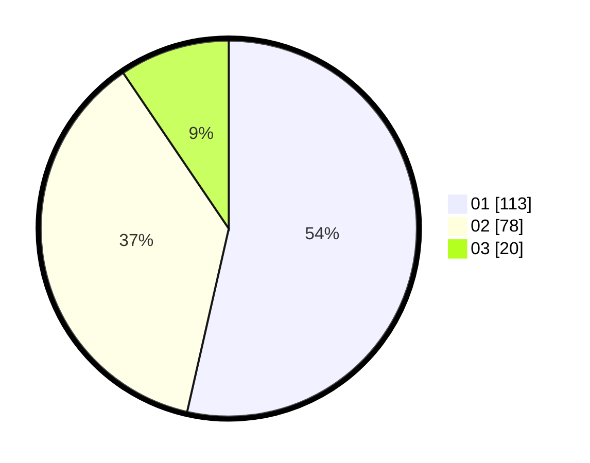

# Hasil

Hasil perolehan suara paslon dapat dilihat pada file paslon-01.txt, paslon-02.txt, dan paslon-03.txt.

Jika tidak ada, artinya data tersebut belum ada pada SIREKAP.

## Perolehan Suara

 * Paslon 01: **113**.
 * Paslon 02: **78**.
 * Paslon 03: **20**.

## Foto C Plano

https://sirekap-obj-formc.kpu.go.id/cdae/pemilu/ppwp/31/75/06/10/03/3175061003093-20240214-184601--6b72235c-3b46-44c6-a08d-e206ce44e991.jpg

https://sirekap-obj-formc.kpu.go.id/cdae/pemilu/ppwp/31/75/06/10/03/3175061003093-20240214-185233--0fb8892d-e906-4b4d-91fc-cf8a7ebdaacc.jpg

https://sirekap-obj-formc.kpu.go.id/cdae/pemilu/ppwp/31/75/06/10/03/3175061003093-20240214-185302--dc343aba-7e49-4f62-a27d-2e9895b3952b.jpg

## DATA PEMILIH TETAP

Jumlah pemilih dalam DPT: **256**.
 * L: **127**.
 * P: **129**.

## DATA PENGGUNA HAK PILIH

Jumlah pengguna hak pilih dalam DPT: **214**.
 * L: **106**.
 * P: **108**.

Jumlah pengguna hak pilih dalam DPTb: **0**.
 * L: **0**.
 * P: **0**.

Jumlah pengguna hak pilih dalam DPK: **2**.
 * L: **2**.
 * P: **0**.

Jumlah pengguna hak pilih: **216**.
 * L: **108**.
 * P: **108**.

## JUMLAH SUARA SAH DAN TIDAK SAH

JUMLAH SELURUH SUARA SAH: **211**.

JUMLAH SUARA TIDAK SAH: **5**.

JUMLAH SELURUH SUARA SAH DAN SUARA TIDAK SAH: **216**.
