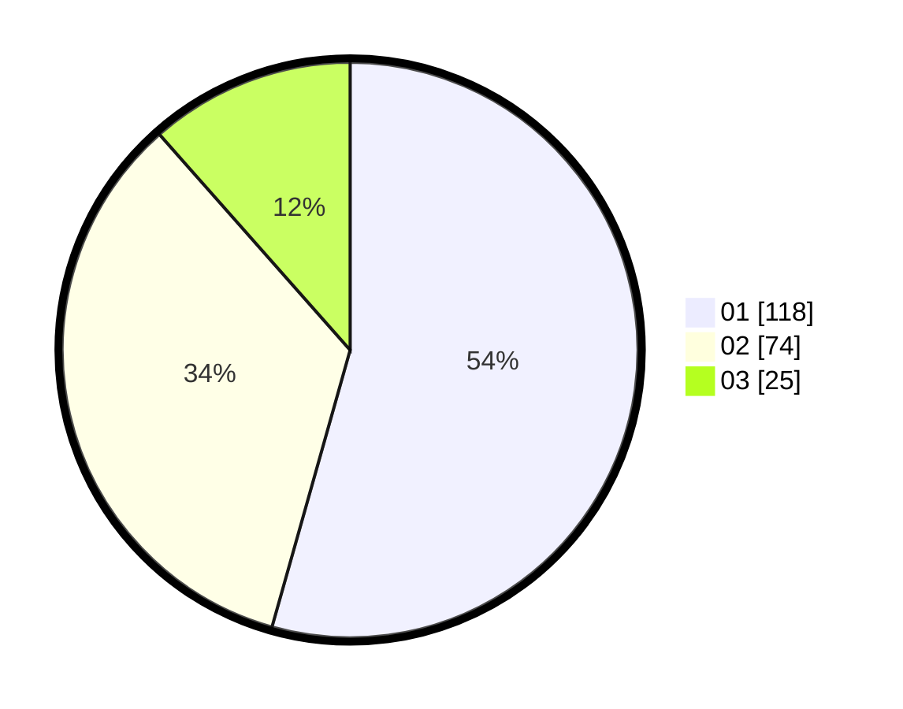

# Hasil

Hasil perolehan suara paslon dapat dilihat pada file paslon-01.txt, paslon-02.txt, dan paslon-03.txt.

Jika tidak ada, artinya data tersebut belum ada pada SIREKAP.

## Perolehan Suara

 * Paslon 01: **118**.
 * Paslon 02: **74**.
 * Paslon 03: **25**.

## Foto C Plano

https://sirekap-obj-formc.kpu.go.id/a436/pemilu/ppwp/31/75/06/10/03/3175061003094-20240216-111814--7eedfb96-60ad-481a-a4fd-43fe19bc55db.jpg

https://sirekap-obj-formc.kpu.go.id/a436/pemilu/ppwp/31/75/06/10/03/3175061003094-20240216-111817--14ebc88a-41ee-4366-b324-eabbb7679b58.jpg

https://sirekap-obj-formc.kpu.go.id/a436/pemilu/ppwp/31/75/06/10/03/3175061003094-20240216-110336--d5aaf1a0-0ffe-44ca-96cb-ec9886b7023c.jpg

## DATA PEMILIH TETAP

Jumlah pemilih dalam DPT: **254**.
 * L: **126**.
 * P: **128**.

## DATA PENGGUNA HAK PILIH

Jumlah pengguna hak pilih dalam DPT: **220**.
 * L: **111**.
 * P: **109**.

Jumlah pengguna hak pilih dalam DPTb: **0**.
 * L: **0**.
 * P: **0**.

Jumlah pengguna hak pilih dalam DPK: **1**.
 * L: **0**.
 * P: **1**.

Jumlah pengguna hak pilih: **221**.
 * L: **111**.
 * P: **110**.

## JUMLAH SUARA SAH DAN TIDAK SAH

JUMLAH SELURUH SUARA SAH: **217**.

JUMLAH SUARA TIDAK SAH: **4**.

JUMLAH SELURUH SUARA SAH DAN SUARA TIDAK SAH: **221**.
