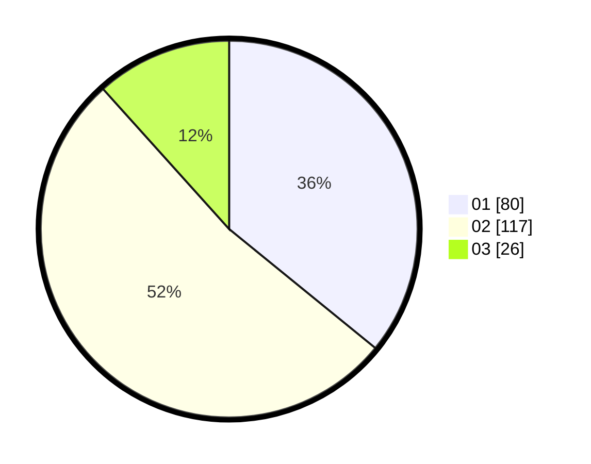

# Hasil

Hasil perolehan suara paslon dapat dilihat pada file paslon-01.txt, paslon-02.txt, dan paslon-03.txt.

Jika tidak ada, artinya data tersebut belum ada pada SIREKAP.

## Perolehan Suara

 * Paslon 01: **80**.
 * Paslon 02: **117**.
 * Paslon 03: **26**.

## Foto C Plano

https://sirekap-obj-formc.kpu.go.id/a836/pemilu/ppwp/31/75/06/10/03/3175061003100-20240214-201606--b432b6e0-19a7-476a-8a5c-3eb7c83df078.jpg

https://sirekap-obj-formc.kpu.go.id/a836/pemilu/ppwp/31/75/06/10/03/3175061003100-20240216-234003--f43f6e5b-8753-4e51-9e41-31d87a4fea14.jpg

https://sirekap-obj-formc.kpu.go.id/a836/pemilu/ppwp/31/75/06/10/03/3175061003100-20240216-234155--8b525666-ed98-4fa2-8409-1002e66429ca.jpg
