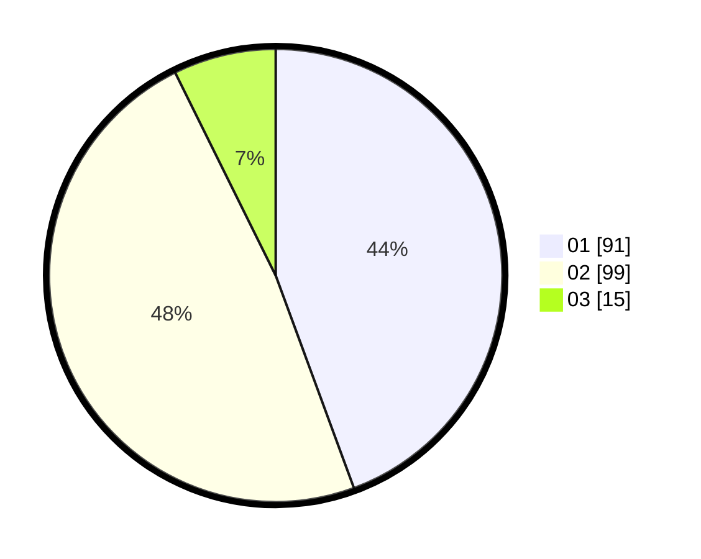

# Hasil

Hasil perolehan suara paslon dapat dilihat pada file paslon-01.txt, paslon-02.txt, dan paslon-03.txt.

Jika tidak ada, artinya data tersebut belum ada pada SIREKAP.

## Perolehan Suara

 * Paslon 01: **91**.
 * Paslon 02: **99**.
 * Paslon 03: **15**.

## Foto C Plano

https://sirekap-obj-formc.kpu.go.id/0e67/pemilu/ppwp/31/75/06/10/03/3175061003104-20240214-191949--b2272083-aeeb-40ec-a365-b3041f421113.jpg

https://sirekap-obj-formc.kpu.go.id/0e67/pemilu/ppwp/31/75/06/10/03/3175061003104-20240214-212157--4260aeca-9a98-46ec-8ea9-7ed1124e38b2.jpg

https://sirekap-obj-formc.kpu.go.id/0e67/pemilu/ppwp/31/75/06/10/03/3175061003104-20240214-194100--01322002-d611-4b0a-8204-9c6d84d5a23c.jpg

## DATA PEMILIH TETAP

Jumlah pemilih dalam DPT: **276**.
 * L: **134**.
 * P: **142**.

## DATA PENGGUNA HAK PILIH

Jumlah pengguna hak pilih dalam DPT: **207**.
 * L: **98**.
 * P: **109**.

Jumlah pengguna hak pilih dalam DPTb: **2**.
 * L: **2**.
 * P: **0**.

Jumlah pengguna hak pilih dalam DPK: **2**.
 * L: **2**.
 * P: **0**.

Jumlah pengguna hak pilih: **211**.
 * L: **102**.
 * P: **109**.

## JUMLAH SUARA SAH DAN TIDAK SAH

JUMLAH SELURUH SUARA SAH: **205**.

JUMLAH SUARA TIDAK SAH: **6**.

JUMLAH SELURUH SUARA SAH DAN SUARA TIDAK SAH: **211**.
