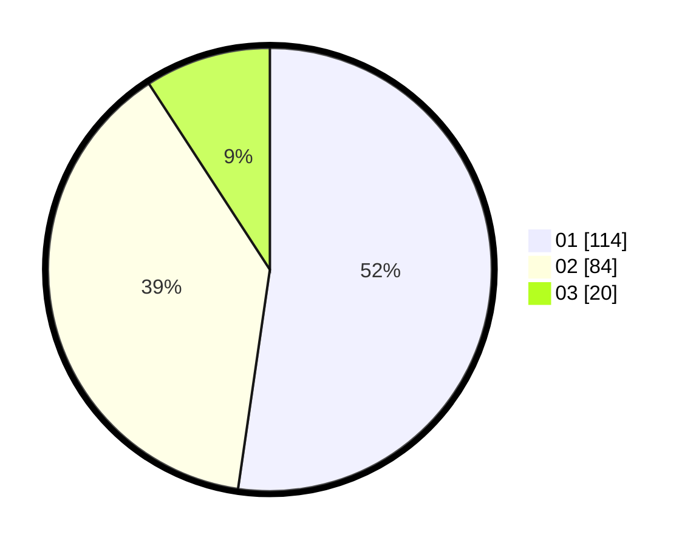

# Hasil

Hasil perolehan suara paslon dapat dilihat pada file paslon-01.txt, paslon-02.txt, dan paslon-03.txt.

Jika tidak ada, artinya data tersebut belum ada pada SIREKAP.

## Perolehan Suara

 * Paslon 01: **114**.
 * Paslon 02: **84**.
 * Paslon 03: **20**.

## Foto C Plano

https://sirekap-obj-formc.kpu.go.id/2898/pemilu/ppwp/31/75/06/10/03/3175061003112-20240214-230844--16bb153a-8554-4616-b5f1-bad062a419f9.jpg

https://sirekap-obj-formc.kpu.go.id/2898/pemilu/ppwp/31/75/06/10/03/3175061003112-20240214-230946--d4b88a3c-3a4f-4a30-a4f3-8371d4dc5158.jpg
