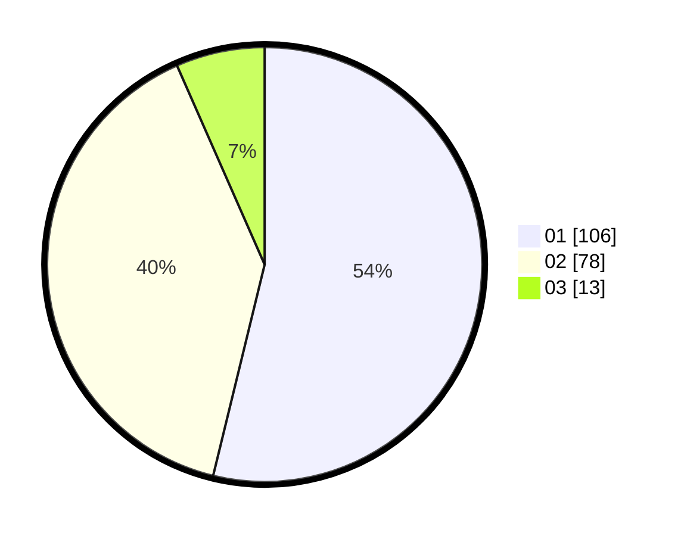

# Hasil

Hasil perolehan suara paslon dapat dilihat pada file paslon-01.txt, paslon-02.txt, dan paslon-03.txt.

Jika tidak ada, artinya data tersebut belum ada pada SIREKAP.

## Perolehan Suara

 * Paslon 01: **106**.
 * Paslon 02: **78**.
 * Paslon 03: **13**.

## Foto C Plano

https://sirekap-obj-formc.kpu.go.id/1ef3/pemilu/ppwp/31/75/06/10/03/3175061003114-20240217-010403--c518007f-3682-4ad2-a27a-987d85ccf934.jpg

https://sirekap-obj-formc.kpu.go.id/1ef3/pemilu/ppwp/31/75/06/10/03/3175061003114-20240217-010404--f57f83e0-4718-4341-9eaf-810502f3c477.jpg

https://sirekap-obj-formc.kpu.go.id/1ef3/pemilu/ppwp/31/75/06/10/03/3175061003114-20240217-010404--0ab64b79-0041-4a60-a7f2-ea00e1884638.jpg

## DATA PEMILIH TETAP

Jumlah pemilih dalam DPT: **286**.
 * L: **141**.
 * P: **145**.

## DATA PENGGUNA HAK PILIH

Jumlah pengguna hak pilih dalam DPT: **197**.
 * L: **88**.
 * P: **109**.

Jumlah pengguna hak pilih dalam DPTb: **0**.
 * L: **0**.
 * P: **0**.

Jumlah pengguna hak pilih dalam DPK: **3**.
 * L: **1**.
 * P: **2**.

Jumlah pengguna hak pilih: **200**.
 * L: **89**.
 * P: **111**.

## JUMLAH SUARA SAH DAN TIDAK SAH

JUMLAH SELURUH SUARA SAH: **197**.

JUMLAH SUARA TIDAK SAH: **3**.

JUMLAH SELURUH SUARA SAH DAN SUARA TIDAK SAH: **200**.
