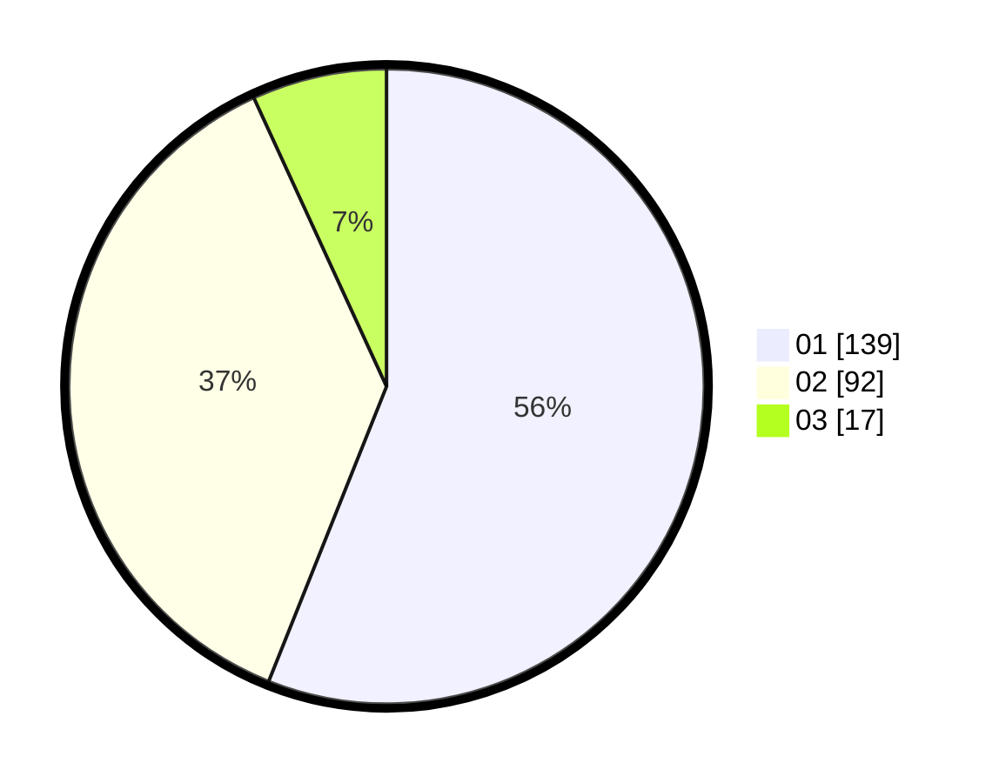

# Hasil

Hasil perolehan suara paslon dapat dilihat pada file paslon-01.txt, paslon-02.txt, dan paslon-03.txt.

Jika tidak ada, artinya data tersebut belum ada pada SIREKAP.

## Perolehan Suara

 * Paslon 01: **139**.
 * Paslon 02: **92**.
 * Paslon 03: **17**.

## Foto C Plano

https://sirekap-obj-formc.kpu.go.id/4059/pemilu/ppwp/31/75/06/10/03/3175061003121-20240214-221729--2eb8b29f-f44a-41ef-b2f2-d688a593a93a.jpg

https://sirekap-obj-formc.kpu.go.id/4059/pemilu/ppwp/31/75/06/10/03/3175061003121-20240214-222003--a308e8ea-1db1-459f-9a51-11ffe3fd069c.jpg

https://sirekap-obj-formc.kpu.go.id/4059/pemilu/ppwp/31/75/06/10/03/3175061003121-20240214-222101--47c850f4-3dc9-42d5-b1c9-3303accf681c.jpg
