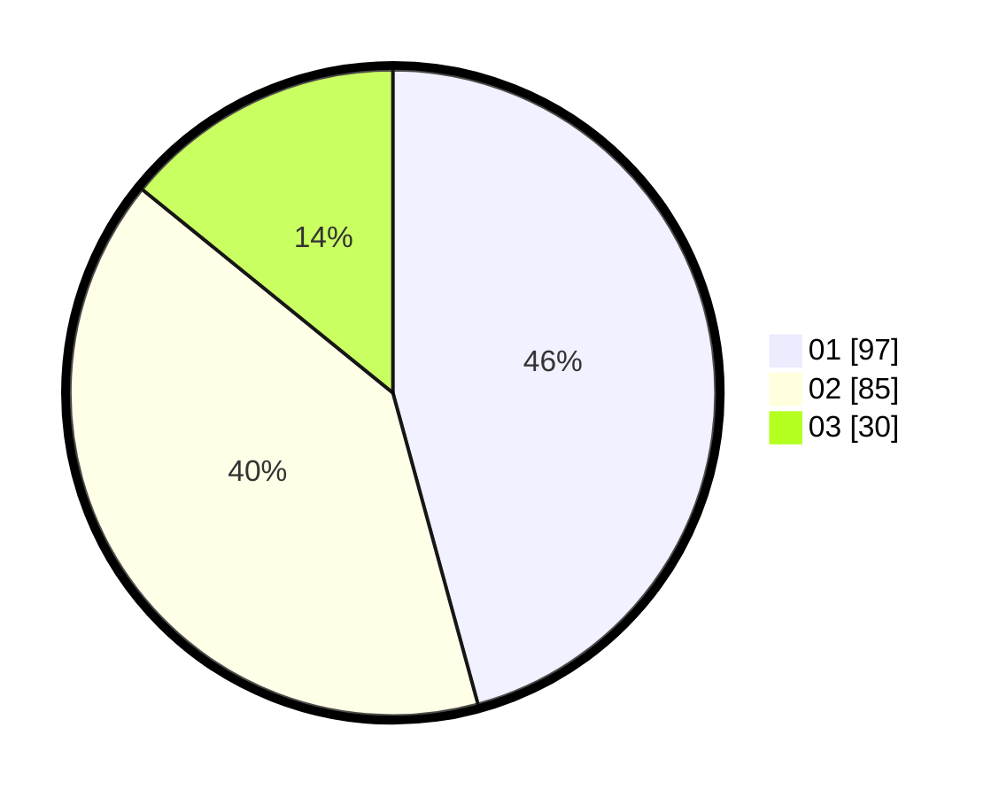

# Hasil

Hasil perolehan suara paslon dapat dilihat pada file paslon-01.txt, paslon-02.txt, dan paslon-03.txt.

Jika tidak ada, artinya data tersebut belum ada pada SIREKAP.

## Perolehan Suara

 * Paslon 01: **97**.
 * Paslon 02: **85**.
 * Paslon 03: **30**.

## Foto C Plano

https://sirekap-obj-formc.kpu.go.id/9103/pemilu/ppwp/31/75/06/10/03/3175061003122-20240216-124900--f5ec4c86-6377-4692-aab2-53c4b5d7dd6a.jpg

https://sirekap-obj-formc.kpu.go.id/9103/pemilu/ppwp/31/75/06/10/03/3175061003122-20240216-124902--679d9209-4554-454a-a9b1-47c0157b5620.jpg

https://sirekap-obj-formc.kpu.go.id/9103/pemilu/ppwp/31/75/06/10/03/3175061003122-20240216-124901--a5d43504-2a7d-426c-bfa3-f32cf9c2b5a3.jpg

## DATA PEMILIH TETAP

Jumlah pemilih dalam DPT: **288**.
 * L: **148**.
 * P: **140**.

## DATA PENGGUNA HAK PILIH

Jumlah pengguna hak pilih dalam DPT: **216**.
 * L: **108**.
 * P: **108**.

Jumlah pengguna hak pilih dalam DPTb: **0**.
 * L: **0**.
 * P: **0**.

Jumlah pengguna hak pilih dalam DPK: **0**.
 * L: **0**.
 * P: **0**.

Jumlah pengguna hak pilih: **216**.
 * L: **108**.
 * P: **108**.

## JUMLAH SUARA SAH DAN TIDAK SAH

JUMLAH SELURUH SUARA SAH: **212**.

JUMLAH SUARA TIDAK SAH: **4**.

JUMLAH SELURUH SUARA SAH DAN SUARA TIDAK SAH: **216**.
