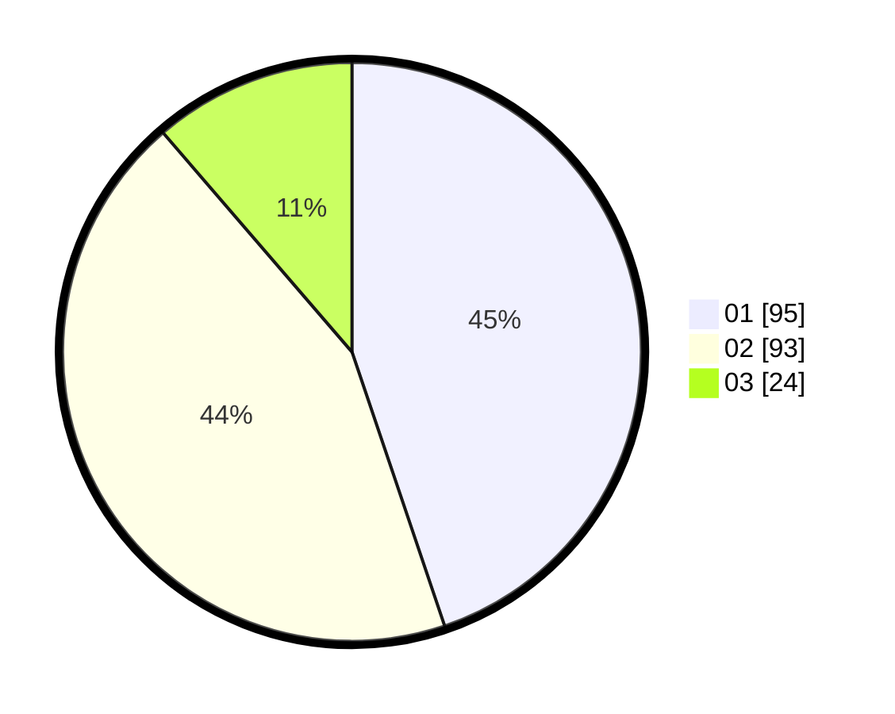

# Hasil

Hasil perolehan suara paslon dapat dilihat pada file paslon-01.txt, paslon-02.txt, dan paslon-03.txt.

Jika tidak ada, artinya data tersebut belum ada pada SIREKAP.

## Perolehan Suara

 * Paslon 01: **95**.
 * Paslon 02: **93**.
 * Paslon 03: **24**.

## Foto C Plano

https://sirekap-obj-formc.kpu.go.id/4cae/pemilu/ppwp/31/75/06/10/03/3175061003123-20240214-231116--c7699a75-4e97-42c4-aec7-df3c632af08a.jpg

https://sirekap-obj-formc.kpu.go.id/4cae/pemilu/ppwp/31/75/06/10/03/3175061003123-20240214-231805--6fe3fb59-12f3-4d5a-b2c5-b052974da051.jpg

https://sirekap-obj-formc.kpu.go.id/4cae/pemilu/ppwp/31/75/06/10/03/3175061003123-20240214-232018--de121f4d-0be7-4399-bdfc-6b32489c378b.jpg
