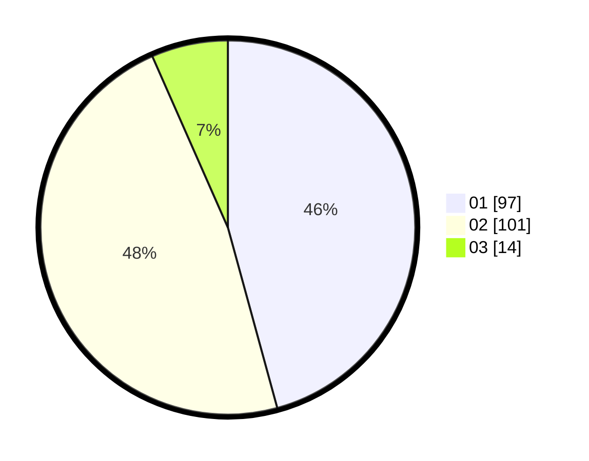

# Hasil

Hasil perolehan suara paslon dapat dilihat pada file paslon-01.txt, paslon-02.txt, dan paslon-03.txt.

Jika tidak ada, artinya data tersebut belum ada pada SIREKAP.

## Perolehan Suara

 * Paslon 01: **97**.
 * Paslon 02: **101**.
 * Paslon 03: **14**.

## Foto C Plano

https://sirekap-obj-formc.kpu.go.id/ca8b/pemilu/ppwp/31/75/06/10/03/3175061003124-20240216-184710--0bb1aa22-fe31-4c46-9d85-4e70af5efacc.jpg

https://sirekap-obj-formc.kpu.go.id/ca8b/pemilu/ppwp/31/75/06/10/03/3175061003124-20240216-184711--86ef4325-b135-4b74-bfb0-d277838ee1de.jpg

https://sirekap-obj-formc.kpu.go.id/ca8b/pemilu/ppwp/31/75/06/10/03/3175061003124-20240216-184710--29cac8bd-2f91-46b4-a953-03cd53017c92.jpg

## DATA PEMILIH TETAP

Jumlah pemilih dalam DPT: **291**.
 * L: **148**.
 * P: **143**.

## DATA PENGGUNA HAK PILIH

Jumlah pengguna hak pilih dalam DPT: **214**.
 * L: **104**.
 * P: **110**.

Jumlah pengguna hak pilih dalam DPTb: **0**.
 * L: **0**.
 * P: **0**.

Jumlah pengguna hak pilih dalam DPK: **1**.
 * L: **0**.
 * P: **1**.

Jumlah pengguna hak pilih: **215**.
 * L: **104**.
 * P: **111**.

## JUMLAH SUARA SAH DAN TIDAK SAH

JUMLAH SELURUH SUARA SAH: **212**.

JUMLAH SUARA TIDAK SAH: **3**.

JUMLAH SELURUH SUARA SAH DAN SUARA TIDAK SAH: **215**.
