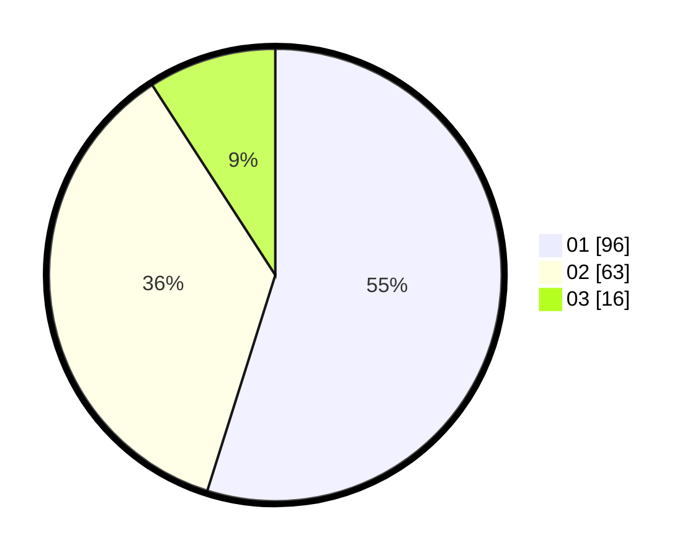

# Hasil

Hasil perolehan suara paslon dapat dilihat pada file paslon-01.txt, paslon-02.txt, dan paslon-03.txt.

Jika tidak ada, artinya data tersebut belum ada pada SIREKAP.

## Perolehan Suara

 * Paslon 01: **96**.
 * Paslon 02: **63**.
 * Paslon 03: **16**.

## Foto C Plano

https://sirekap-obj-formc.kpu.go.id/89eb/pemilu/ppwp/31/75/06/10/03/3175061003126-20240214-203616--02e0ef1f-8884-4870-aaf8-2eda2ea766dc.jpg

https://sirekap-obj-formc.kpu.go.id/89eb/pemilu/ppwp/31/75/06/10/03/3175061003126-20240214-212745--c53ec123-57aa-40f3-a01b-1de34701467d.jpg

https://sirekap-obj-formc.kpu.go.id/89eb/pemilu/ppwp/31/75/06/10/03/3175061003126-20240214-203916--861e7f62-a65f-4280-a958-f436cc6a4d81.jpg

## DATA PEMILIH TETAP

Jumlah pemilih dalam DPT: **177**.
 * L: **75**.
 * P: **102**.

## DATA PENGGUNA HAK PILIH

Jumlah pengguna hak pilih dalam DPT: **177**.
 * L: **75**.
 * P: **102**.

Jumlah pengguna hak pilih dalam DPTb: **0**.
 * L: **0**.
 * P: **0**.

Jumlah pengguna hak pilih dalam DPK: **0**.
 * L: **0**.
 * P: **0**.

Jumlah pengguna hak pilih: **177**.
 * L: **75**.
 * P: **102**.

## JUMLAH SUARA SAH DAN TIDAK SAH

JUMLAH SELURUH SUARA SAH: **175**.

JUMLAH SUARA TIDAK SAH: **2**.

JUMLAH SELURUH SUARA SAH DAN SUARA TIDAK SAH: **177**.
