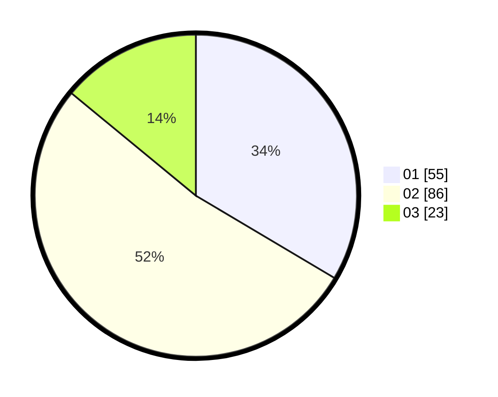

# Hasil

Hasil perolehan suara paslon dapat dilihat pada file paslon-01.txt, paslon-02.txt, dan paslon-03.txt.

Jika tidak ada, artinya data tersebut belum ada pada SIREKAP.

## Perolehan Suara

 * Paslon 01: **55**.
 * Paslon 02: **86**.
 * Paslon 03: **23**.

## Foto C Plano

https://sirekap-obj-formc.kpu.go.id/650f/pemilu/ppwp/31/75/06/10/03/3175061003132-20240215-204625--cd89eddc-7d80-41fe-a786-511bfeb37837.jpg

https://sirekap-obj-formc.kpu.go.id/650f/pemilu/ppwp/31/75/06/10/03/3175061003132-20240215-204627--1a79dacd-3f2d-4fe8-a319-4e7172d97be3.jpg

https://sirekap-obj-formc.kpu.go.id/650f/pemilu/ppwp/31/75/06/10/03/3175061003132-20240215-204626--4685d76f-2268-4706-835d-95eeade96249.jpg

## DATA PEMILIH TETAP

Jumlah pemilih dalam DPT: **161**.
 * L: **78**.
 * P: **83**.

## DATA PENGGUNA HAK PILIH

Jumlah pengguna hak pilih dalam DPT: **161**.
 * L: **78**.
 * P: **83**.

Jumlah pengguna hak pilih dalam DPTb: **0**.
 * L: **0**.
 * P: **0**.

Jumlah pengguna hak pilih dalam DPK: **5**.
 * L: **2**.
 * P: **3**.

Jumlah pengguna hak pilih: **166**.
 * L: **80**.
 * P: **86**.

## JUMLAH SUARA SAH DAN TIDAK SAH

JUMLAH SELURUH SUARA SAH: **164**.

JUMLAH SUARA TIDAK SAH: **2**.

JUMLAH SELURUH SUARA SAH DAN SUARA TIDAK SAH: **166**.
