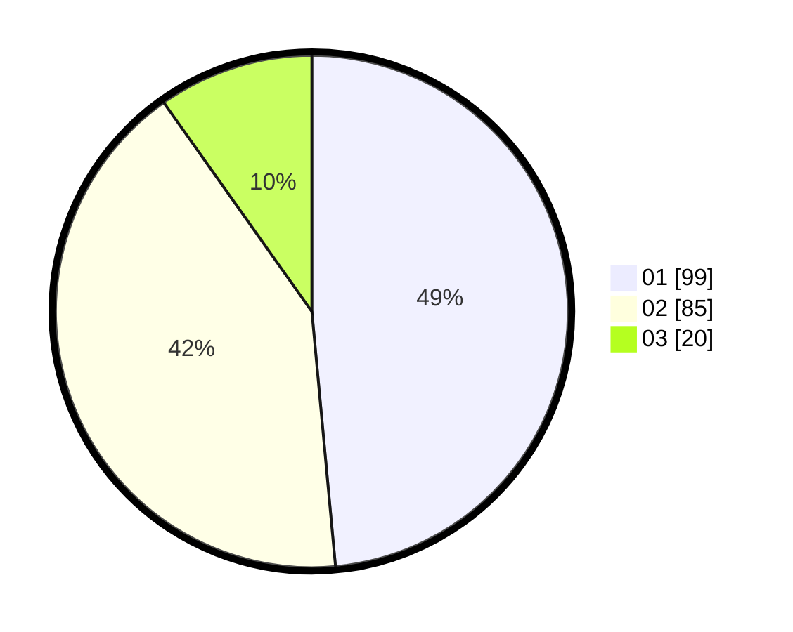

# Hasil

Hasil perolehan suara paslon dapat dilihat pada file paslon-01.txt, paslon-02.txt, dan paslon-03.txt.

Jika tidak ada, artinya data tersebut belum ada pada SIREKAP.

## Perolehan Suara

 * Paslon 01: **99**.
 * Paslon 02: **85**.
 * Paslon 03: **20**.

## Foto C Plano

https://sirekap-obj-formc.kpu.go.id/c8f7/pemilu/ppwp/31/75/06/10/03/3175061003137-20240214-210358--dafffaaa-9ca4-40f3-977f-66dd3477c2f0.jpg

https://sirekap-obj-formc.kpu.go.id/c8f7/pemilu/ppwp/31/75/06/10/03/3175061003137-20240214-202458--9f72ae64-9216-4722-beb0-fc5e7c554af6.jpg

https://sirekap-obj-formc.kpu.go.id/c8f7/pemilu/ppwp/31/75/06/10/03/3175061003137-20240214-220801--52d38d29-64b1-48c7-ab1a-77e6150126d3.jpg
