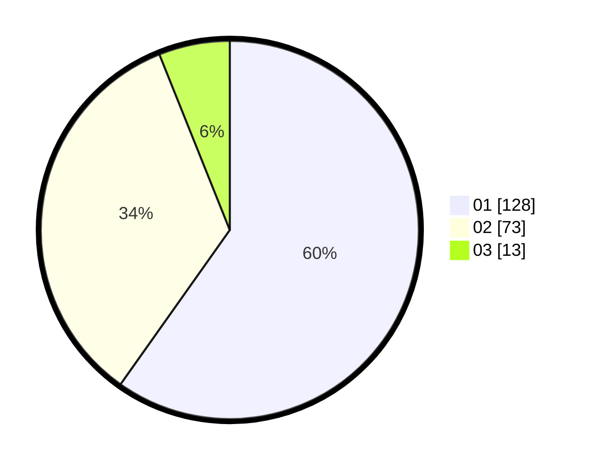

# Hasil

Hasil perolehan suara paslon dapat dilihat pada file paslon-01.txt, paslon-02.txt, dan paslon-03.txt.

Jika tidak ada, artinya data tersebut belum ada pada SIREKAP.

## Perolehan Suara

 * Paslon 01: **128**.
 * Paslon 02: **73**.
 * Paslon 03: **13**.

## Foto C Plano

https://sirekap-obj-formc.kpu.go.id/b11c/pemilu/ppwp/31/75/06/10/03/3175061003141-20240216-014906--c21d20f5-e17a-4b9c-85ca-95d5552a6001.jpg

https://sirekap-obj-formc.kpu.go.id/b11c/pemilu/ppwp/31/75/06/10/03/3175061003141-20240216-015115--216e05dc-44e5-4aa0-90d1-0086ff71e3de.jpg

https://sirekap-obj-formc.kpu.go.id/b11c/pemilu/ppwp/31/75/06/10/03/3175061003141-20240216-015114--d7ec1ced-744c-41ee-8650-58c95255cd9f.jpg

## DATA PEMILIH TETAP

Jumlah pemilih dalam DPT: **279**.
 * L: **145**.
 * P: **137**.

## DATA PENGGUNA HAK PILIH

Jumlah pengguna hak pilih dalam DPT: **216**.
 * L: **105**.
 * P: **111**.

Jumlah pengguna hak pilih dalam DPTb: **0**.
 * L: **0**.
 * P: **0**.

Jumlah pengguna hak pilih dalam DPK: **1**.
 * L: **0**.
 * P: **1**.

Jumlah pengguna hak pilih: **217**.
 * L: **105**.
 * P: **112**.

## JUMLAH SUARA SAH DAN TIDAK SAH

JUMLAH SELURUH SUARA SAH: **214**.

JUMLAH SUARA TIDAK SAH: **3**.

JUMLAH SELURUH SUARA SAH DAN SUARA TIDAK SAH: **217**.
