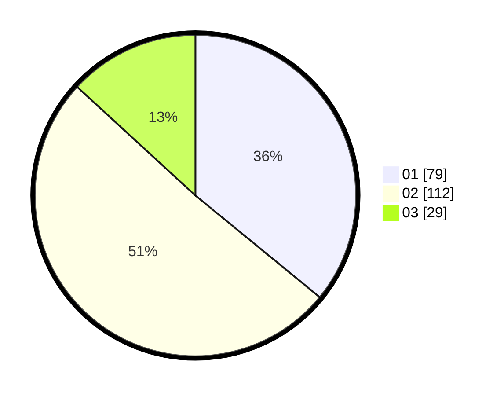

# Hasil

Hasil perolehan suara paslon dapat dilihat pada file paslon-01.txt, paslon-02.txt, dan paslon-03.txt.

Jika tidak ada, artinya data tersebut belum ada pada SIREKAP.

## Perolehan Suara

 * Paslon 01: **79**.
 * Paslon 02: **112**.
 * Paslon 03: **29**.

## Foto C Plano

https://sirekap-obj-formc.kpu.go.id/da04/pemilu/ppwp/31/75/06/10/03/3175061003142-20240216-055300--bc23d7ef-d477-4764-a449-66c2acd96053.jpg

https://sirekap-obj-formc.kpu.go.id/da04/pemilu/ppwp/31/75/06/10/03/3175061003142-20240216-055307--2571e025-a779-40f0-a251-c0e249cc5241.jpg

https://sirekap-obj-formc.kpu.go.id/da04/pemilu/ppwp/31/75/06/10/03/3175061003142-20240216-055301--eb4aaa59-3ce3-4389-854e-e638205ee5fc.jpg

## DATA PEMILIH TETAP

Jumlah pemilih dalam DPT: **270**.
 * L: **143**.
 * P: **127**.

## DATA PENGGUNA HAK PILIH

Jumlah pengguna hak pilih dalam DPT: **202**.
 * L: **98**.
 * P: **104**.

Jumlah pengguna hak pilih dalam DPTb: **21**.
 * L: **17**.
 * P: **4**.

Jumlah pengguna hak pilih dalam DPK: **1**.
 * L: **0**.
 * P: **1**.

Jumlah pengguna hak pilih: **224**.
 * L: **115**.
 * P: **109**.

## JUMLAH SUARA SAH DAN TIDAK SAH

JUMLAH SELURUH SUARA SAH: **220**.

JUMLAH SUARA TIDAK SAH: **4**.

JUMLAH SELURUH SUARA SAH DAN SUARA TIDAK SAH: **224**.
