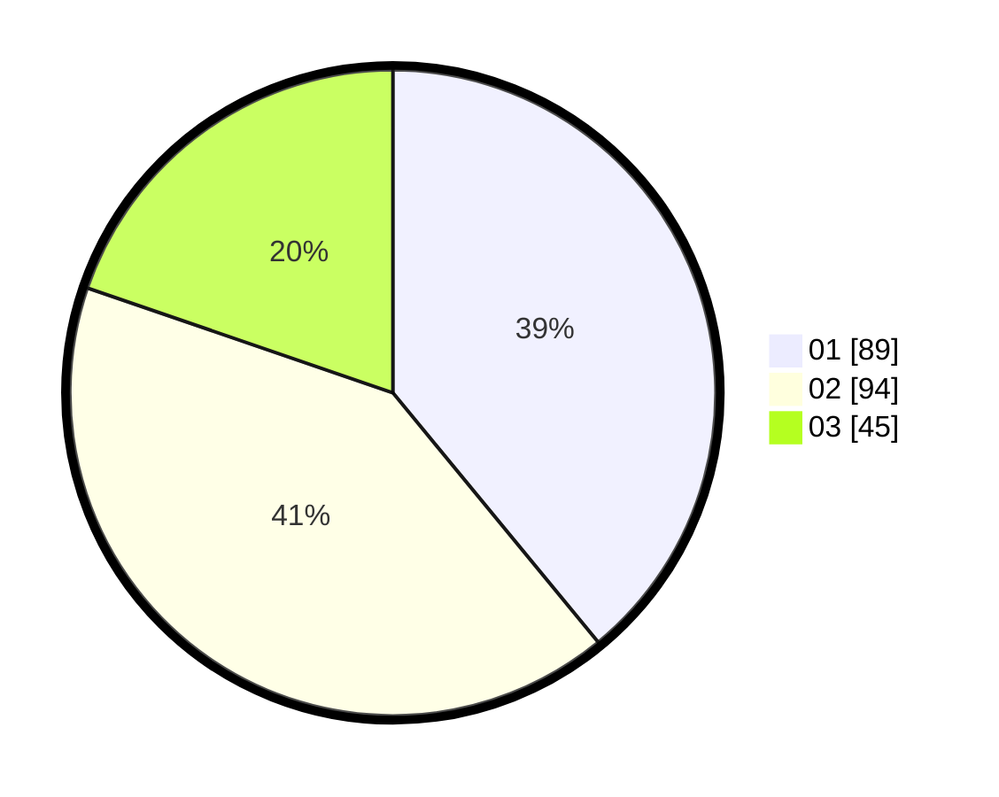

# Hasil

Hasil perolehan suara paslon dapat dilihat pada file paslon-01.txt, paslon-02.txt, dan paslon-03.txt.

Jika tidak ada, artinya data tersebut belum ada pada SIREKAP.

## Perolehan Suara

 * Paslon 01: **89**.
 * Paslon 02: **94**.
 * Paslon 03: **45**.

## Foto C Plano

https://sirekap-obj-formc.kpu.go.id/660c/pemilu/ppwp/31/75/06/10/03/3175061003143-20240214-212044--8c7dd058-0f79-41fa-b3b8-d9e348d89a77.jpg

https://sirekap-obj-formc.kpu.go.id/660c/pemilu/ppwp/31/75/06/10/03/3175061003143-20240214-213022--8a844197-04f9-4564-af3e-de8e4d053dbe.jpg

https://sirekap-obj-formc.kpu.go.id/660c/pemilu/ppwp/31/75/06/10/03/3175061003143-20240214-212208--9ed80e6a-6bdd-49ec-890b-7eb61d3a23ef.jpg

## DATA PEMILIH TETAP

Jumlah pemilih dalam DPT: **222**.
 * L: **101**.
 * P: **121**.

## DATA PENGGUNA HAK PILIH

Jumlah pengguna hak pilih dalam DPT: **283**.
 * L: **139**.
 * P: **144**.

Jumlah pengguna hak pilih dalam DPTb: **3**.
 * L: **3**.
 * P: **0**.

Jumlah pengguna hak pilih dalam DPK: **3**.
 * L: **2**.
 * P: **1**.

Jumlah pengguna hak pilih: **289**.
 * L: **144**.
 * P: **145**.

## JUMLAH SUARA SAH DAN TIDAK SAH

JUMLAH SELURUH SUARA SAH: **228**.

JUMLAH SUARA TIDAK SAH: **0**.

JUMLAH SELURUH SUARA SAH DAN SUARA TIDAK SAH: **228**.
