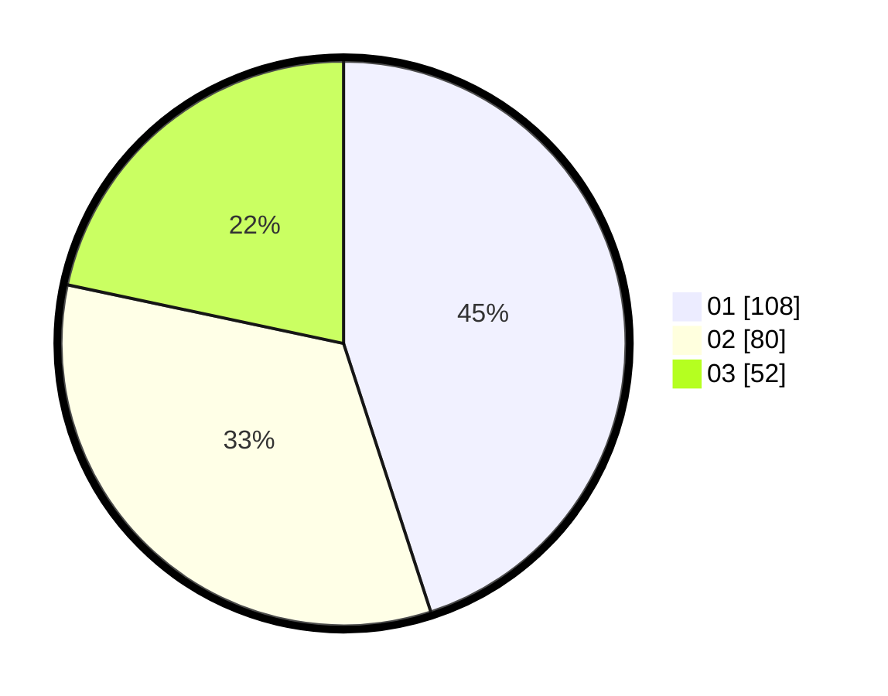

# Hasil

Hasil perolehan suara paslon dapat dilihat pada file paslon-01.txt, paslon-02.txt, dan paslon-03.txt.

Jika tidak ada, artinya data tersebut belum ada pada SIREKAP.

## Perolehan Suara

 * Paslon 01: **108**.
 * Paslon 02: **80**.
 * Paslon 03: **52**.

## Foto C Plano

https://sirekap-obj-formc.kpu.go.id/3e17/pemilu/ppwp/31/75/06/10/03/3175061003150-20240216-085117--3e93af99-a12d-46f0-a1d4-54fa5579c1af.jpg

https://sirekap-obj-formc.kpu.go.id/3e17/pemilu/ppwp/31/75/06/10/03/3175061003150-20240216-084705--d87c0255-a954-46d9-8db7-76b4f2942391.jpg

https://sirekap-obj-formc.kpu.go.id/3e17/pemilu/ppwp/31/75/06/10/03/3175061003150-20240216-084832--9a2ab2b4-4674-4910-bd6c-b53283252255.jpg
