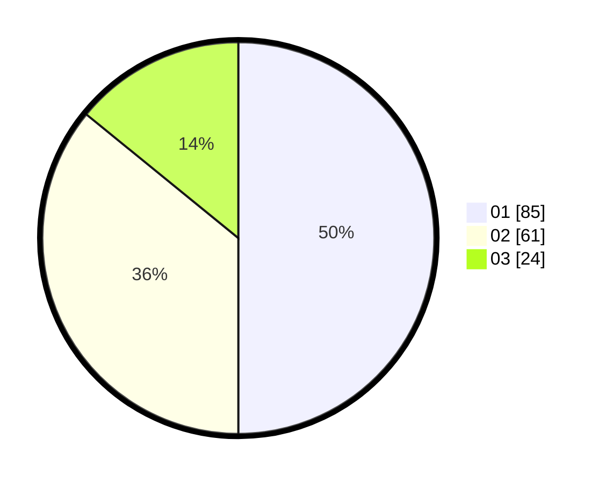

# Hasil

Hasil perolehan suara paslon dapat dilihat pada file paslon-01.txt, paslon-02.txt, dan paslon-03.txt.

Jika tidak ada, artinya data tersebut belum ada pada SIREKAP.

## Perolehan Suara

 * Paslon 01: **85**.
 * Paslon 02: **61**.
 * Paslon 03: **24**.

## Foto C Plano

https://sirekap-obj-formc.kpu.go.id/720c/pemilu/ppwp/31/75/06/10/03/3175061003155-20240216-070334--f400890a-f1eb-4c65-9d43-732bb329af4d.jpg

https://sirekap-obj-formc.kpu.go.id/720c/pemilu/ppwp/31/75/06/10/03/3175061003155-20240216-070335--90226f4f-cfbe-4529-9398-a380827b8908.jpg

https://sirekap-obj-formc.kpu.go.id/720c/pemilu/ppwp/31/75/06/10/03/3175061003155-20240216-070335--a6bc1965-e478-46b3-afeb-da34265ece66.jpg

## DATA PEMILIH TETAP

Jumlah pemilih dalam DPT: **233**.
 * L: **119**.
 * P: **114**.

## DATA PENGGUNA HAK PILIH

Jumlah pengguna hak pilih dalam DPT: **173**.
 * L: **88**.
 * P: **85**.

Jumlah pengguna hak pilih dalam DPTb: **1**.
 * L: **0**.
 * P: **1**.

Jumlah pengguna hak pilih dalam DPK: **0**.
 * L: **0**.
 * P: **0**.

Jumlah pengguna hak pilih: **174**.
 * L: **88**.
 * P: **86**.

## JUMLAH SUARA SAH DAN TIDAK SAH

JUMLAH SELURUH SUARA SAH: **170**.

JUMLAH SUARA TIDAK SAH: **4**.

JUMLAH SELURUH SUARA SAH DAN SUARA TIDAK SAH: **174**.
