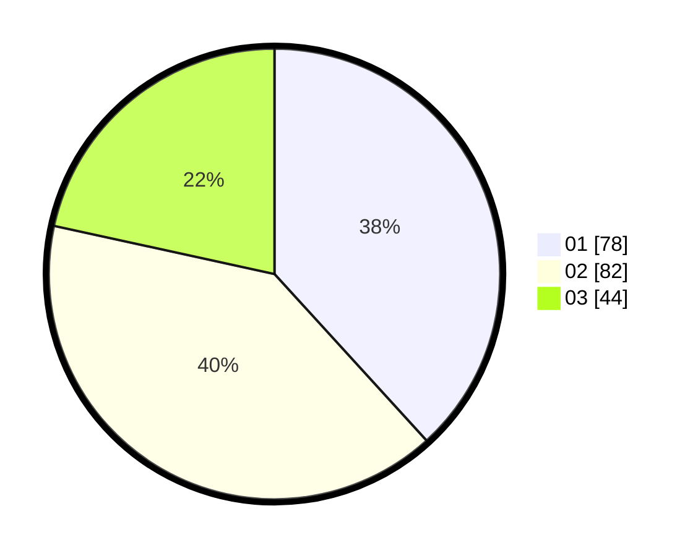

# Hasil

Hasil perolehan suara paslon dapat dilihat pada file paslon-01.txt, paslon-02.txt, dan paslon-03.txt.

Jika tidak ada, artinya data tersebut belum ada pada SIREKAP.

## Perolehan Suara

 * Paslon 01: **78**.
 * Paslon 02: **82**.
 * Paslon 03: **44**.

## Foto C Plano

https://sirekap-obj-formc.kpu.go.id/ce35/pemilu/ppwp/31/75/06/10/03/3175061003159-20240216-000239--827ac004-8cfb-475f-86dd-bd01200c50a9.jpg

https://sirekap-obj-formc.kpu.go.id/ce35/pemilu/ppwp/31/75/06/10/03/3175061003159-20240216-000240--0791d70c-ed85-42f2-9552-fedfbe10c02d.jpg

https://sirekap-obj-formc.kpu.go.id/ce35/pemilu/ppwp/31/75/06/10/03/3175061003159-20240216-000240--5db27edd-1cee-4860-9da0-3f5b6198f7d3.jpg

## DATA PEMILIH TETAP

Jumlah pemilih dalam DPT: **297**.
 * L: **153**.
 * P: **144**.

## DATA PENGGUNA HAK PILIH

Jumlah pengguna hak pilih dalam DPT: **206**.
 * L: **103**.
 * P: **103**.

Jumlah pengguna hak pilih dalam DPTb: **2**.
 * L: **1**.
 * P: **1**.

Jumlah pengguna hak pilih dalam DPK: **1**.
 * L: **0**.
 * P: **1**.

Jumlah pengguna hak pilih: **209**.
 * L: **104**.
 * P: **105**.

## JUMLAH SUARA SAH DAN TIDAK SAH

JUMLAH SELURUH SUARA SAH: **204**.

JUMLAH SUARA TIDAK SAH: **5**.

JUMLAH SELURUH SUARA SAH DAN SUARA TIDAK SAH: **209**.
