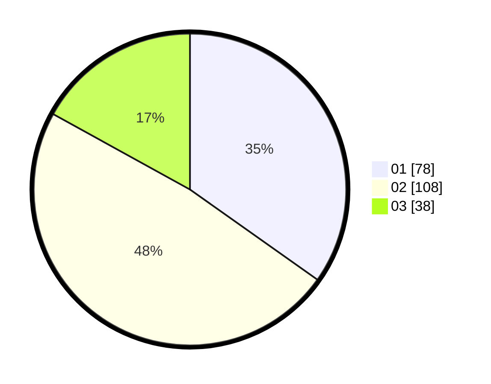

# Hasil

Hasil perolehan suara paslon dapat dilihat pada file paslon-01.txt, paslon-02.txt, dan paslon-03.txt.

Jika tidak ada, artinya data tersebut belum ada pada SIREKAP.

## Perolehan Suara

 * Paslon 01: **78**.
 * Paslon 02: **108**.
 * Paslon 03: **38**.

## Foto C Plano

https://sirekap-obj-formc.kpu.go.id/de87/pemilu/ppwp/31/75/06/10/03/3175061003163-20240215-001623--23e2c970-1403-4a1c-9135-72629d4f82a0.jpg

https://sirekap-obj-formc.kpu.go.id/de87/pemilu/ppwp/31/75/06/10/03/3175061003163-20240215-001716--d0874b59-b4c9-4d90-9cf8-7e5977d4678f.jpg

https://sirekap-obj-formc.kpu.go.id/de87/pemilu/ppwp/31/75/06/10/03/3175061003163-20240215-001903--70aa6e43-27f8-4515-837a-6423574301e6.jpg
