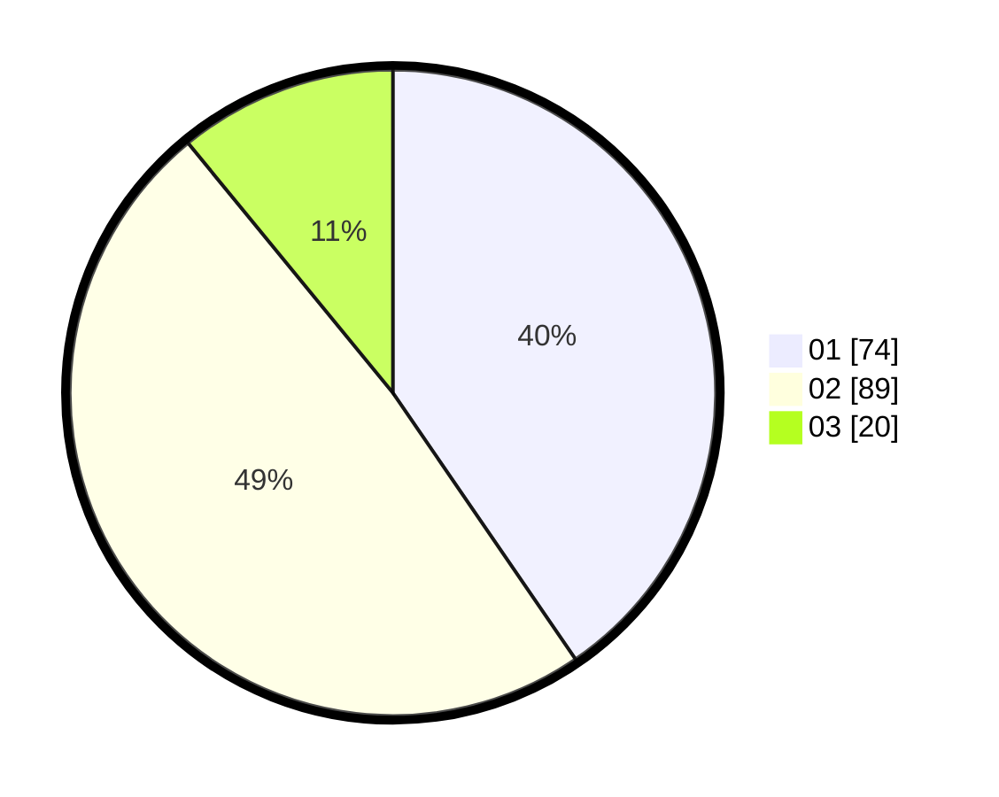

# Hasil

Hasil perolehan suara paslon dapat dilihat pada file paslon-01.txt, paslon-02.txt, dan paslon-03.txt.

Jika tidak ada, artinya data tersebut belum ada pada SIREKAP.

## Perolehan Suara

 * Paslon 01: **74**.
 * Paslon 02: **89**.
 * Paslon 03: **20**.

## Foto C Plano

https://sirekap-obj-formc.kpu.go.id/70cb/pemilu/ppwp/31/75/06/10/03/3175061003164-20240214-155515--672d46cd-d855-45d7-8612-950e8e75044a.jpg

https://sirekap-obj-formc.kpu.go.id/70cb/pemilu/ppwp/31/75/06/10/03/3175061003164-20240214-155611--f4ee0c6f-ef54-4e8a-ae1c-fde19dc4872b.jpg

https://sirekap-obj-formc.kpu.go.id/70cb/pemilu/ppwp/31/75/06/10/03/3175061003164-20240214-155321--7ab3102c-cc3e-48c4-8154-644983d49064.jpg
