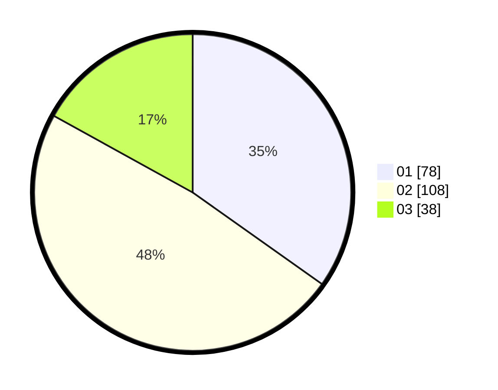

# Hasil

Hasil perolehan suara paslon dapat dilihat pada file paslon-01.txt, paslon-02.txt, dan paslon-03.txt.

Jika tidak ada, artinya data tersebut belum ada pada SIREKAP.

## Perolehan Suara

 * Paslon 01: **78**.
 * Paslon 02: **108**.
 * Paslon 03: **38**.

## Foto C Plano

https://sirekap-obj-formc.kpu.go.id/dfd1/pemilu/ppwp/31/75/06/10/03/3175061003166-20240216-130509--10372046-e6f2-4144-a2db-9b0b4f778ef0.jpg

https://sirekap-obj-formc.kpu.go.id/dfd1/pemilu/ppwp/31/75/06/10/03/3175061003166-20240216-130515--927812d6-158d-4646-9ead-3d5bfe590c8e.jpg

https://sirekap-obj-formc.kpu.go.id/dfd1/pemilu/ppwp/31/75/06/10/03/3175061003166-20240216-130511--5c9ebb35-7b7d-4721-aade-c0b97194f061.jpg

## DATA PEMILIH TETAP

Jumlah pemilih dalam DPT: **223**.
 * L: **112**.
 * P: **111**.

## DATA PENGGUNA HAK PILIH

Jumlah pengguna hak pilih dalam DPT: **223**.
 * L: **112**.
 * P: **111**.

Jumlah pengguna hak pilih dalam DPTb: **2**.
 * L: **2**.
 * P: **0**.

Jumlah pengguna hak pilih dalam DPK: **2**.
 * L: **1**.
 * P: **1**.

Jumlah pengguna hak pilih: **227**.
 * L: **115**.
 * P: **112**.

## JUMLAH SUARA SAH DAN TIDAK SAH

JUMLAH SELURUH SUARA SAH: **224**.

JUMLAH SUARA TIDAK SAH: **3**.

JUMLAH SELURUH SUARA SAH DAN SUARA TIDAK SAH: **227**.
