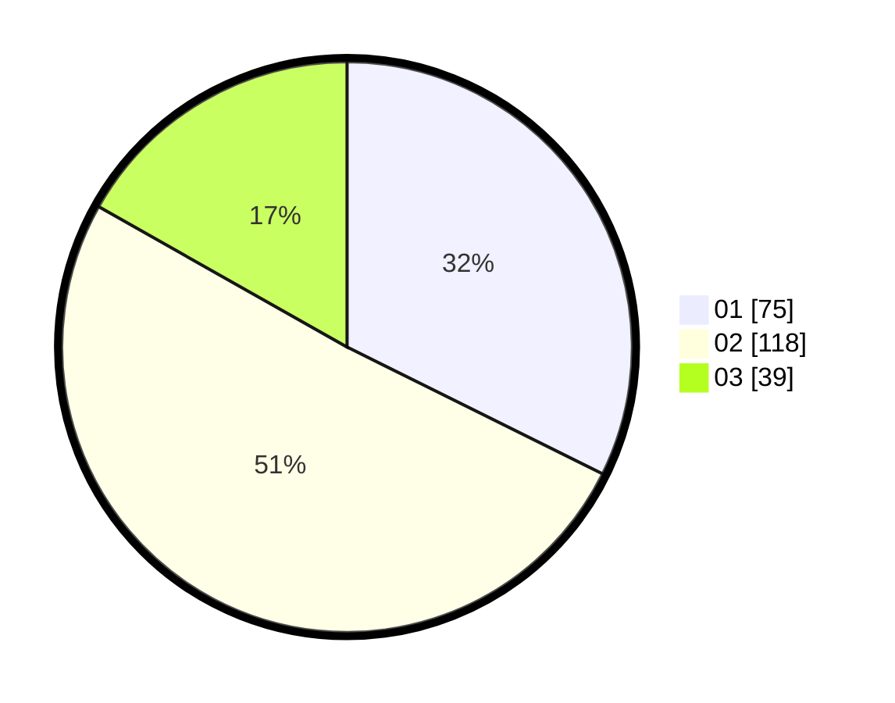

# Hasil

Hasil perolehan suara paslon dapat dilihat pada file paslon-01.txt, paslon-02.txt, dan paslon-03.txt.

Jika tidak ada, artinya data tersebut belum ada pada SIREKAP.

## Perolehan Suara

 * Paslon 01: **75**.
 * Paslon 02: **118**.
 * Paslon 03: **39**.

## Foto C Plano

https://sirekap-obj-formc.kpu.go.id/648a/pemilu/ppwp/31/75/06/10/03/3175061003168-20240216-042547--8faf09f1-f59f-46b5-9119-a027dca8d43f.jpg

https://sirekap-obj-formc.kpu.go.id/648a/pemilu/ppwp/31/75/06/10/03/3175061003168-20240216-042553--3bed2ac4-c358-4842-ac13-438429997d32.jpg

https://sirekap-obj-formc.kpu.go.id/648a/pemilu/ppwp/31/75/06/10/03/3175061003168-20240216-042548--546a86b7-b560-4b4b-b6ef-2f22f7e3c60b.jpg

## DATA PEMILIH TETAP

Jumlah pemilih dalam DPT: **294**.
 * L: **148**.
 * P: **146**.

## DATA PENGGUNA HAK PILIH

Jumlah pengguna hak pilih dalam DPT: **227**.
 * L: **111**.
 * P: **116**.

Jumlah pengguna hak pilih dalam DPTb: **2**.
 * L: **1**.
 * P: **1**.

Jumlah pengguna hak pilih dalam DPK: **6**.
 * L: **3**.
 * P: **3**.

Jumlah pengguna hak pilih: **235**.
 * L: **115**.
 * P: **120**.

## JUMLAH SUARA SAH DAN TIDAK SAH

JUMLAH SELURUH SUARA SAH: **232**.

JUMLAH SUARA TIDAK SAH: **3**.

JUMLAH SELURUH SUARA SAH DAN SUARA TIDAK SAH: **235**.
