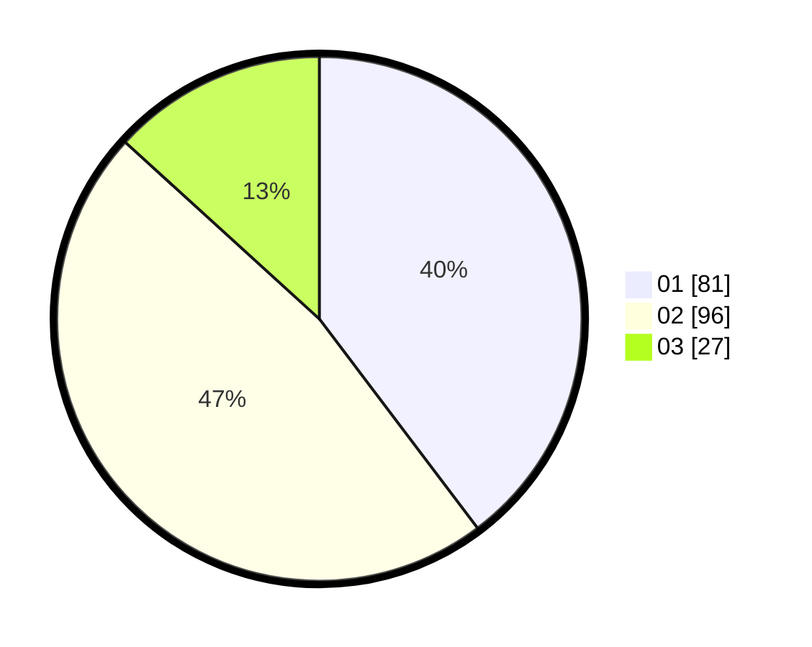

# Hasil

Hasil perolehan suara paslon dapat dilihat pada file paslon-01.txt, paslon-02.txt, dan paslon-03.txt.

Jika tidak ada, artinya data tersebut belum ada pada SIREKAP.

## Perolehan Suara

 * Paslon 01: **81**.
 * Paslon 02: **96**.
 * Paslon 03: **27**.

## Foto C Plano

https://sirekap-obj-formc.kpu.go.id/2f07/pemilu/ppwp/31/75/06/10/03/3175061003173-20240214-191108--8f7ea440-982c-4790-9ef7-bf08c0f58ad8.jpg

https://sirekap-obj-formc.kpu.go.id/2f07/pemilu/ppwp/31/75/06/10/03/3175061003173-20240214-191111--5a465149-0276-4993-a71a-19ab7fc096d7.jpg

https://sirekap-obj-formc.kpu.go.id/2f07/pemilu/ppwp/31/75/06/10/03/3175061003173-20240214-193944--2e3848a4-377d-4f62-b5a9-fa76d62319b1.jpg

## DATA PEMILIH TETAP

Jumlah pemilih dalam DPT: **266**.
 * L: **146**.
 * P: **120**.

## DATA PENGGUNA HAK PILIH

Jumlah pengguna hak pilih dalam DPT: **207**.
 * L: **102**.
 * P: **105**.

Jumlah pengguna hak pilih dalam DPTb: **0**.
 * L: **0**.
 * P: **0**.

Jumlah pengguna hak pilih dalam DPK: **0**.
 * L: **0**.
 * P: **0**.

Jumlah pengguna hak pilih: **207**.
 * L: **102**.
 * P: **105**.

## JUMLAH SUARA SAH DAN TIDAK SAH

JUMLAH SELURUH SUARA SAH: **204**.

JUMLAH SUARA TIDAK SAH: **3**.

JUMLAH SELURUH SUARA SAH DAN SUARA TIDAK SAH: **207**.
