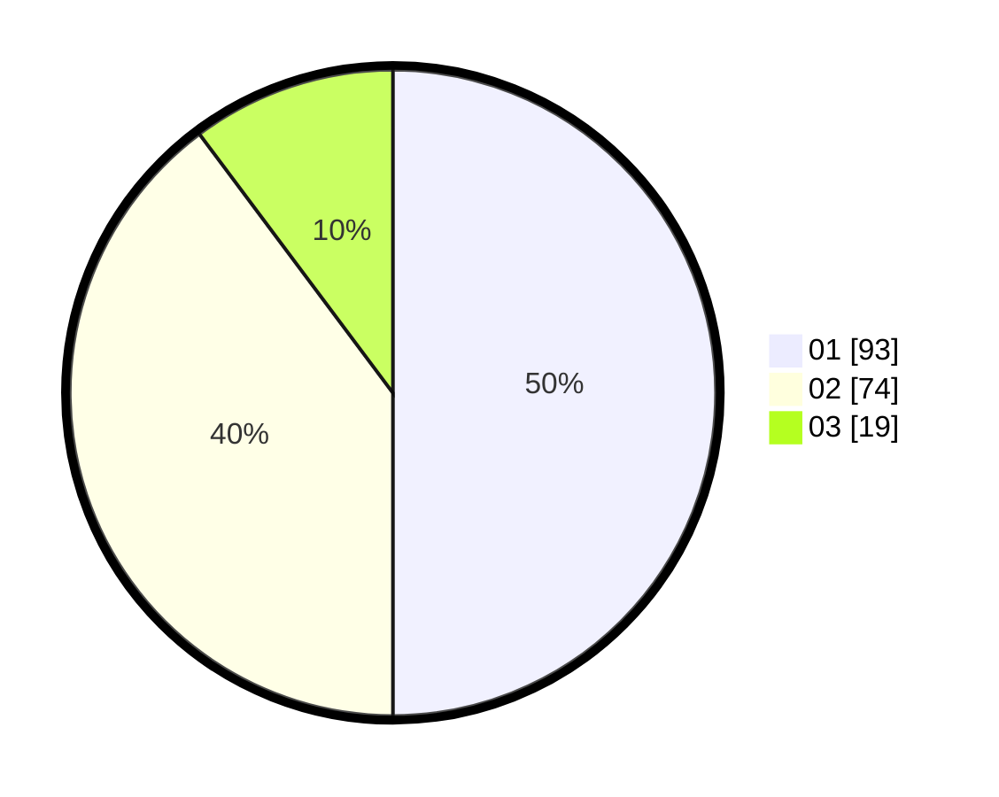

# Hasil

Hasil perolehan suara paslon dapat dilihat pada file paslon-01.txt, paslon-02.txt, dan paslon-03.txt.

Jika tidak ada, artinya data tersebut belum ada pada SIREKAP.

## Perolehan Suara

 * Paslon 01: **93**.
 * Paslon 02: **74**.
 * Paslon 03: **19**.

## Foto C Plano

https://sirekap-obj-formc.kpu.go.id/5ffd/pemilu/ppwp/31/75/06/10/03/3175061003176-20240216-150557--bc2b0fdb-23ac-4e14-b65f-bceac8497a7d.jpg

https://sirekap-obj-formc.kpu.go.id/5ffd/pemilu/ppwp/31/75/06/10/03/3175061003176-20240216-150559--32ab1bd7-793b-4a74-b843-34165110d64c.jpg

https://sirekap-obj-formc.kpu.go.id/5ffd/pemilu/ppwp/31/75/06/10/03/3175061003176-20240216-150558--c57c0102-9e45-49f7-a809-86fbc7dfa3f3.jpg

## DATA PEMILIH TETAP

Jumlah pemilih dalam DPT: **187**.
 * L: **100**.
 * P: **87**.

## DATA PENGGUNA HAK PILIH

Jumlah pengguna hak pilih dalam DPT: **266**.
 * L: **145**.
 * P: **121**.

Jumlah pengguna hak pilih dalam DPTb: **0**.
 * L: **0**.
 * P: **0**.

Jumlah pengguna hak pilih dalam DPK: **0**.
 * L: **0**.
 * P: **0**.

Jumlah pengguna hak pilih: **266**.
 * L: **145**.
 * P: **121**.

## JUMLAH SUARA SAH DAN TIDAK SAH

JUMLAH SELURUH SUARA SAH: **186**.

JUMLAH SUARA TIDAK SAH: **1**.

JUMLAH SELURUH SUARA SAH DAN SUARA TIDAK SAH: **187**.
