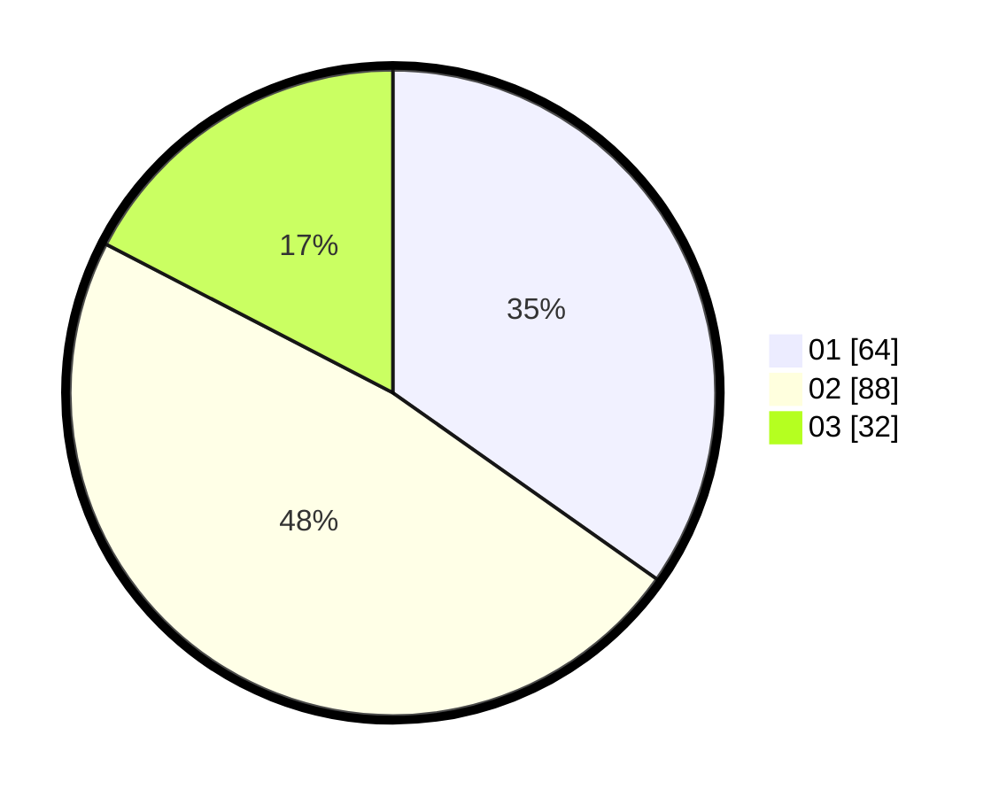

# Hasil

Hasil perolehan suara paslon dapat dilihat pada file paslon-01.txt, paslon-02.txt, dan paslon-03.txt.

Jika tidak ada, artinya data tersebut belum ada pada SIREKAP.

## Perolehan Suara

 * Paslon 01: **64**.
 * Paslon 02: **88**.
 * Paslon 03: **32**.

## Foto C Plano

https://sirekap-obj-formc.kpu.go.id/c83d/pemilu/ppwp/31/75/06/10/03/3175061003181-20240214-230129--1467b0c9-b91d-4698-8cc0-89a99c60535a.jpg

https://sirekap-obj-formc.kpu.go.id/c83d/pemilu/ppwp/31/75/06/10/03/3175061003181-20240214-230151--2daffac5-28f0-4f45-9c24-4d53984b0aa8.jpg

https://sirekap-obj-formc.kpu.go.id/c83d/pemilu/ppwp/31/75/06/10/03/3175061003181-20240214-230216--51161cb3-13d4-4862-8a9e-65ea9c945e03.jpg
