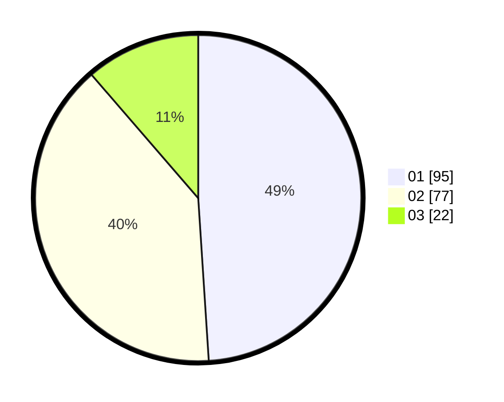

# Hasil

Hasil perolehan suara paslon dapat dilihat pada file paslon-01.txt, paslon-02.txt, dan paslon-03.txt.

Jika tidak ada, artinya data tersebut belum ada pada SIREKAP.

## Perolehan Suara

 * Paslon 01: **95**.
 * Paslon 02: **77**.
 * Paslon 03: **22**.

## Foto C Plano

https://sirekap-obj-formc.kpu.go.id/af13/pemilu/ppwp/31/75/06/10/03/3175061003183-20240216-043659--27216c20-bd87-4625-a378-af48374dc52c.jpg

https://sirekap-obj-formc.kpu.go.id/af13/pemilu/ppwp/31/75/06/10/03/3175061003183-20240216-043700--253dfac2-75c7-4b5a-b7e8-dd07340d5248.jpg

https://sirekap-obj-formc.kpu.go.id/af13/pemilu/ppwp/31/75/06/10/03/3175061003183-20240216-043659--d7fd10ab-c167-4efb-91bd-743c17203050.jpg

## DATA PEMILIH TETAP

Jumlah pemilih dalam DPT: **256**.
 * L: **124**.
 * P: **132**.

## DATA PENGGUNA HAK PILIH

Jumlah pengguna hak pilih dalam DPT: **194**.
 * L: **88**.
 * P: **106**.

Jumlah pengguna hak pilih dalam DPTb: **0**.
 * L: **0**.
 * P: **0**.

Jumlah pengguna hak pilih dalam DPK: **1**.
 * L: **0**.
 * P: **1**.

Jumlah pengguna hak pilih: **195**.
 * L: **88**.
 * P: **107**.

## JUMLAH SUARA SAH DAN TIDAK SAH

JUMLAH SELURUH SUARA SAH: **194**.

JUMLAH SUARA TIDAK SAH: **1**.

JUMLAH SELURUH SUARA SAH DAN SUARA TIDAK SAH: **195**.
