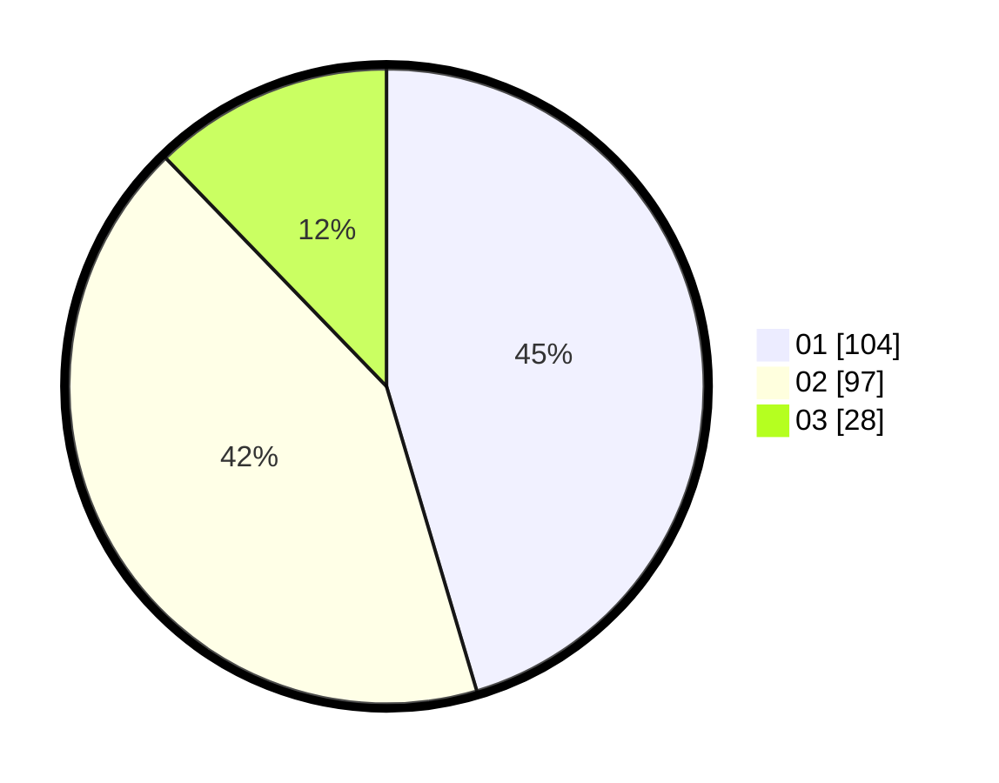

# Hasil

Hasil perolehan suara paslon dapat dilihat pada file paslon-01.txt, paslon-02.txt, dan paslon-03.txt.

Jika tidak ada, artinya data tersebut belum ada pada SIREKAP.

## Perolehan Suara

 * Paslon 01: **104**.
 * Paslon 02: **97**.
 * Paslon 03: **28**.

## Foto C Plano

https://sirekap-obj-formc.kpu.go.id/0d7d/pemilu/ppwp/31/75/06/10/03/3175061003186-20240215-205652--629521fa-2e49-4529-9b73-ffcde767b06b.jpg

https://sirekap-obj-formc.kpu.go.id/0d7d/pemilu/ppwp/31/75/06/10/03/3175061003186-20240215-205653--080a5b92-c06a-4cf9-b762-e523f9856fba.jpg

https://sirekap-obj-formc.kpu.go.id/0d7d/pemilu/ppwp/31/75/06/10/03/3175061003186-20240215-205653--9fe651a9-7c74-4de9-9819-616f835107bc.jpg

## DATA PEMILIH TETAP

Jumlah pemilih dalam DPT: **300**.
 * L: **152**.
 * P: **148**.

## DATA PENGGUNA HAK PILIH

Jumlah pengguna hak pilih dalam DPT: **300**.
 * L: **152**.
 * P: **148**.

Jumlah pengguna hak pilih dalam DPTb: **0**.
 * L: **0**.
 * P: **0**.

Jumlah pengguna hak pilih dalam DPK: **0**.
 * L: **0**.
 * P: **0**.

Jumlah pengguna hak pilih: **300**.
 * L: **152**.
 * P: **148**.

## JUMLAH SUARA SAH DAN TIDAK SAH

JUMLAH SELURUH SUARA SAH: **229**.

JUMLAH SUARA TIDAK SAH: **5**.

JUMLAH SELURUH SUARA SAH DAN SUARA TIDAK SAH: **234**.
