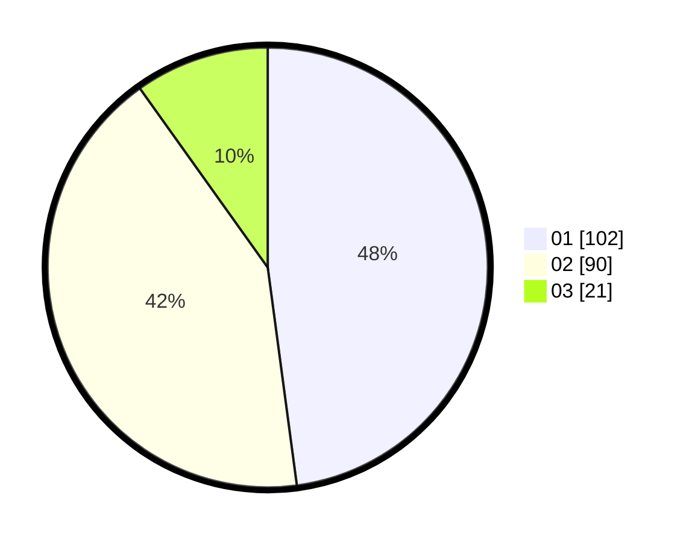

# Hasil

Hasil perolehan suara paslon dapat dilihat pada file paslon-01.txt, paslon-02.txt, dan paslon-03.txt.

Jika tidak ada, artinya data tersebut belum ada pada SIREKAP.

## Perolehan Suara

 * Paslon 01: **102**.
 * Paslon 02: **90**.
 * Paslon 03: **21**.

## Foto C Plano

https://sirekap-obj-formc.kpu.go.id/7d26/pemilu/ppwp/31/75/06/10/03/3175061003188-20240214-191229--a19d4f8b-cbb3-43ee-899e-346204da5a94.jpg

https://sirekap-obj-formc.kpu.go.id/7d26/pemilu/ppwp/31/75/06/10/03/3175061003188-20240214-194934--4f411980-c99d-4117-ba3c-7925db78ad51.jpg
