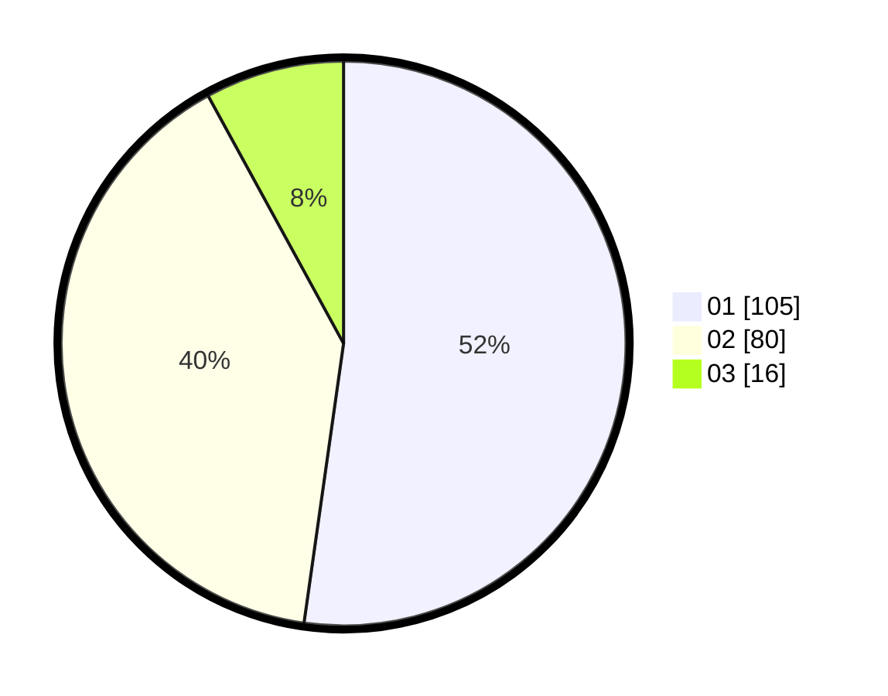

# Hasil

Hasil perolehan suara paslon dapat dilihat pada file paslon-01.txt, paslon-02.txt, dan paslon-03.txt.

Jika tidak ada, artinya data tersebut belum ada pada SIREKAP.

## Perolehan Suara

 * Paslon 01: **105**.
 * Paslon 02: **80**.
 * Paslon 03: **16**.

## Foto C Plano

https://sirekap-obj-formc.kpu.go.id/de53/pemilu/ppwp/31/75/06/10/03/3175061003190-20240215-214408--8c919b1c-1d6a-4468-b2d5-711bf1b81f99.jpg

https://sirekap-obj-formc.kpu.go.id/de53/pemilu/ppwp/31/75/06/10/03/3175061003190-20240214-200124--2b6bf5e0-14ea-4d51-ac7b-8ae9045a9f43.jpg

https://sirekap-obj-formc.kpu.go.id/de53/pemilu/ppwp/31/75/06/10/03/3175061003190-20240214-194951--326963d7-9de5-47bb-91be-68c208817704.jpg

## DATA PEMILIH TETAP

Jumlah pemilih dalam DPT: **288**.
 * L: **143**.
 * P: **145**.

## DATA PENGGUNA HAK PILIH

Jumlah pengguna hak pilih dalam DPT: **279**.
 * L: **138**.
 * P: **141**.

Jumlah pengguna hak pilih dalam DPTb: **0**.
 * L: **0**.
 * P: **0**.

Jumlah pengguna hak pilih dalam DPK: **2**.
 * L: **1**.
 * P: **1**.

Jumlah pengguna hak pilih: **281**.
 * L: **139**.
 * P: **142**.

## JUMLAH SUARA SAH DAN TIDAK SAH

JUMLAH SELURUH SUARA SAH: **201**.

JUMLAH SUARA TIDAK SAH: **1**.

JUMLAH SELURUH SUARA SAH DAN SUARA TIDAK SAH: **202**.
