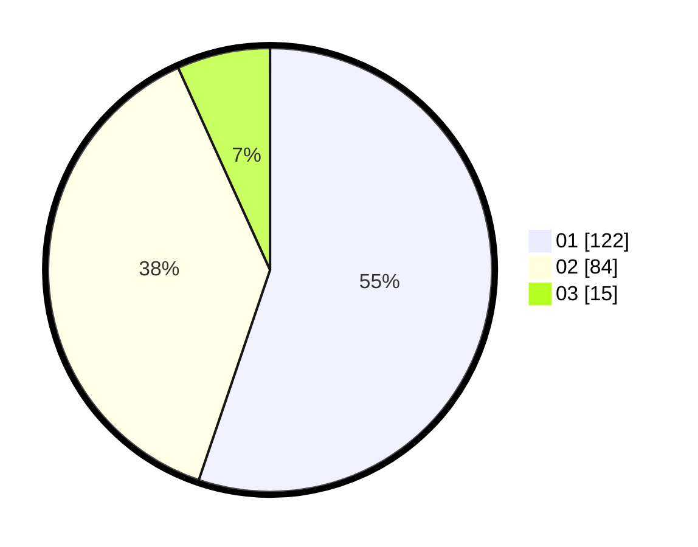

# Hasil

Hasil perolehan suara paslon dapat dilihat pada file paslon-01.txt, paslon-02.txt, dan paslon-03.txt.

Jika tidak ada, artinya data tersebut belum ada pada SIREKAP.

## Perolehan Suara

 * Paslon 01: **122**.
 * Paslon 02: **84**.
 * Paslon 03: **15**.

## Foto C Plano

https://sirekap-obj-formc.kpu.go.id/92ee/pemilu/ppwp/31/75/06/10/03/3175061003191-20240215-004255--db18cf19-f962-4d6b-8303-52039ab65df4.jpg

https://sirekap-obj-formc.kpu.go.id/92ee/pemilu/ppwp/31/75/06/10/03/3175061003191-20240215-004525--fa73030a-339c-4a4c-9086-7ce64d9cf2ed.jpg

https://sirekap-obj-formc.kpu.go.id/92ee/pemilu/ppwp/31/75/06/10/03/3175061003191-20240215-004756--9a7e3075-c0a8-4c54-9a1f-ec0ada35b50e.jpg
