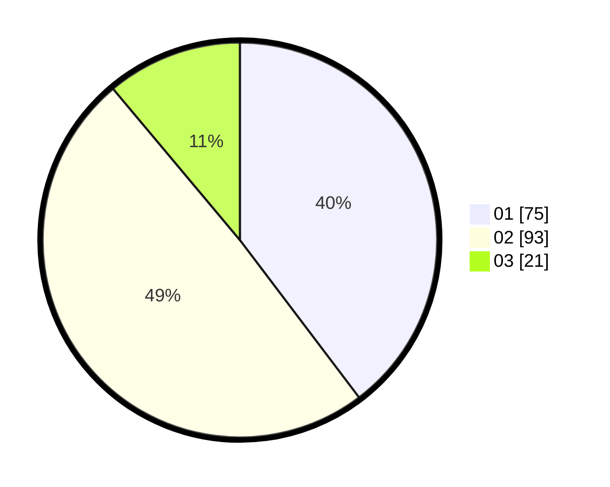

# Hasil

Hasil perolehan suara paslon dapat dilihat pada file paslon-01.txt, paslon-02.txt, dan paslon-03.txt.

Jika tidak ada, artinya data tersebut belum ada pada SIREKAP.

## Perolehan Suara

 * Paslon 01: **75**.
 * Paslon 02: **93**.
 * Paslon 03: **21**.

## Foto C Plano

https://sirekap-obj-formc.kpu.go.id/4453/pemilu/ppwp/31/75/06/10/03/3175061003192-20240215-151009--f5c54034-f136-4b68-ba3b-d39da0654f24.jpg

https://sirekap-obj-formc.kpu.go.id/4453/pemilu/ppwp/31/75/06/10/03/3175061003192-20240214-155031--d1fb9145-b75a-42f2-859c-068069826e38.jpg

https://sirekap-obj-formc.kpu.go.id/4453/pemilu/ppwp/31/75/06/10/03/3175061003192-20240214-155210--e1d15e94-fabc-408d-90b1-aa90b744b2f6.jpg
