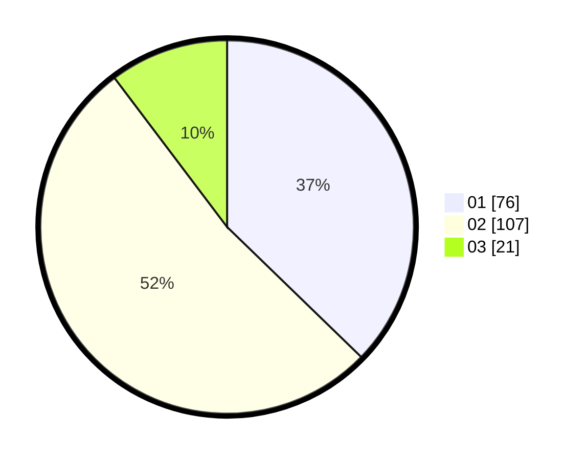

# Hasil

Hasil perolehan suara paslon dapat dilihat pada file paslon-01.txt, paslon-02.txt, dan paslon-03.txt.

Jika tidak ada, artinya data tersebut belum ada pada SIREKAP.

## Perolehan Suara

 * Paslon 01: **76**.
 * Paslon 02: **107**.
 * Paslon 03: **21**.

## Foto C Plano

https://sirekap-obj-formc.kpu.go.id/6f9a/pemilu/ppwp/31/75/06/10/03/3175061003193-20240215-114440--dd96ef67-2d92-498a-9789-88d854c53efc.jpg

https://sirekap-obj-formc.kpu.go.id/6f9a/pemilu/ppwp/31/75/06/10/03/3175061003193-20240215-114502--73bbd5de-f7d5-4342-89bf-93ed2f23f5b0.jpg

https://sirekap-obj-formc.kpu.go.id/6f9a/pemilu/ppwp/31/75/06/10/03/3175061003193-20240215-114450--aa248b11-e694-4392-902a-11a4281c5228.jpg

## DATA PEMILIH TETAP

Jumlah pemilih dalam DPT: **290**.
 * L: **152**.
 * P: **138**.

## DATA PENGGUNA HAK PILIH

Jumlah pengguna hak pilih dalam DPT: **209**.
 * L: **108**.
 * P: **101**.

Jumlah pengguna hak pilih dalam DPTb: **1**.
 * L: **0**.
 * P: **1**.

Jumlah pengguna hak pilih dalam DPK: **0**.
 * L: **0**.
 * P: **0**.

Jumlah pengguna hak pilih: **210**.
 * L: **108**.
 * P: **102**.

## JUMLAH SUARA SAH DAN TIDAK SAH

JUMLAH SELURUH SUARA SAH: **204**.

JUMLAH SUARA TIDAK SAH: **6**.

JUMLAH SELURUH SUARA SAH DAN SUARA TIDAK SAH: **210**.
