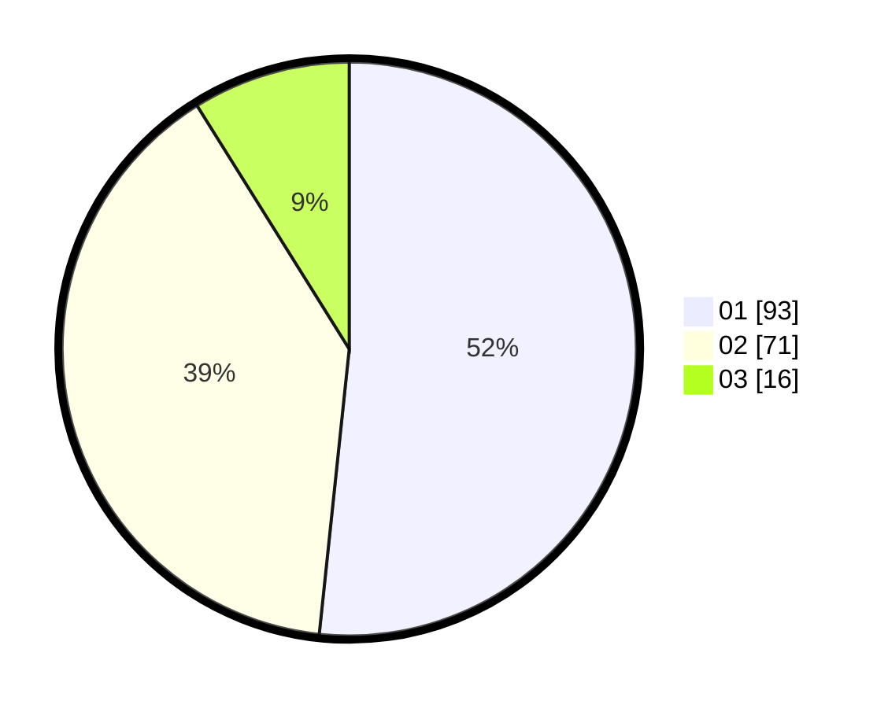

# Hasil

Hasil perolehan suara paslon dapat dilihat pada file paslon-01.txt, paslon-02.txt, dan paslon-03.txt.

Jika tidak ada, artinya data tersebut belum ada pada SIREKAP.

## Perolehan Suara

 * Paslon 01: **93**.
 * Paslon 02: **71**.
 * Paslon 03: **16**.

## Foto C Plano

https://sirekap-obj-formc.kpu.go.id/f6b9/pemilu/ppwp/31/75/06/10/03/3175061003194-20240216-090700--833d07f8-e0d7-49f8-a179-f49e0d2249c4.jpg

https://sirekap-obj-formc.kpu.go.id/f6b9/pemilu/ppwp/31/75/06/10/03/3175061003194-20240216-090701--4c8d0342-0281-4a9c-9ef0-68c02fc98992.jpg

https://sirekap-obj-formc.kpu.go.id/f6b9/pemilu/ppwp/31/75/06/10/03/3175061003194-20240216-090700--9c5007b9-88b6-474e-958f-b2e7e9955e9b.jpg

## DATA PEMILIH TETAP

Jumlah pemilih dalam DPT: **249**.
 * L: **126**.
 * P: **123**.

## DATA PENGGUNA HAK PILIH

Jumlah pengguna hak pilih dalam DPT: **169**.
 * L: **85**.
 * P: **84**.

Jumlah pengguna hak pilih dalam DPTb: **0**.
 * L: **0**.
 * P: **0**.

Jumlah pengguna hak pilih dalam DPK: **12**.
 * L: **5**.
 * P: **7**.

Jumlah pengguna hak pilih: **181**.
 * L: **90**.
 * P: **91**.

## JUMLAH SUARA SAH DAN TIDAK SAH

JUMLAH SELURUH SUARA SAH: **180**.

JUMLAH SUARA TIDAK SAH: **1**.

JUMLAH SELURUH SUARA SAH DAN SUARA TIDAK SAH: **181**.
