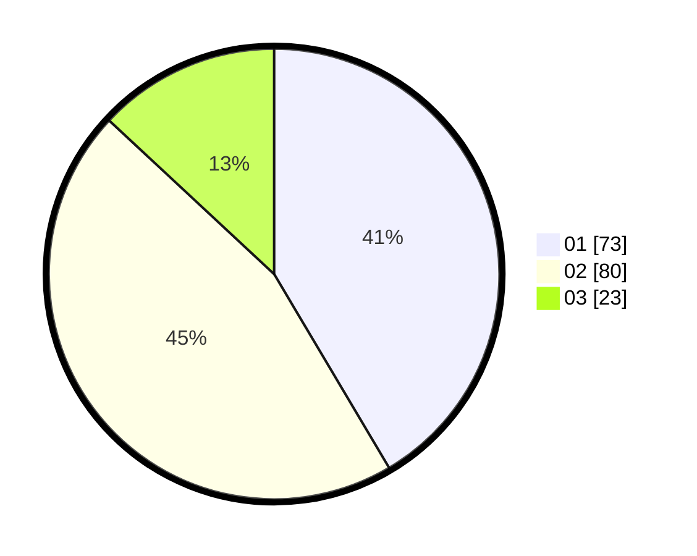

# Hasil

Hasil perolehan suara paslon dapat dilihat pada file paslon-01.txt, paslon-02.txt, dan paslon-03.txt.

Jika tidak ada, artinya data tersebut belum ada pada SIREKAP.

## Perolehan Suara

 * Paslon 01: **73**.
 * Paslon 02: **80**.
 * Paslon 03: **23**.

## Foto C Plano

https://sirekap-obj-formc.kpu.go.id/d79b/pemilu/ppwp/31/75/06/10/03/3175061003196-20240214-195540--0f265a91-6a2d-4c9a-a66d-c77ecd68d075.jpg

https://sirekap-obj-formc.kpu.go.id/d79b/pemilu/ppwp/31/75/06/10/03/3175061003196-20240216-151114--fe2f7670-0618-4fb2-a81d-af384c8ee4a0.jpg

https://sirekap-obj-formc.kpu.go.id/d79b/pemilu/ppwp/31/75/06/10/03/3175061003196-20240216-151114--cbdcc275-ba06-475c-b6b6-eddd94b2ae6d.jpg

## DATA PEMILIH TETAP

Jumlah pemilih dalam DPT: **247**.
 * L: **123**.
 * P: **124**.

## DATA PENGGUNA HAK PILIH

Jumlah pengguna hak pilih dalam DPT: **247**.
 * L: **123**.
 * P: **124**.

Jumlah pengguna hak pilih dalam DPTb: **0**.
 * L: **0**.
 * P: **0**.

Jumlah pengguna hak pilih dalam DPK: **0**.
 * L: **0**.
 * P: **0**.

Jumlah pengguna hak pilih: **247**.
 * L: **123**.
 * P: **124**.

## JUMLAH SUARA SAH DAN TIDAK SAH

JUMLAH SELURUH SUARA SAH: **176**.

JUMLAH SUARA TIDAK SAH: **4**.

JUMLAH SELURUH SUARA SAH DAN SUARA TIDAK SAH: **180**.
