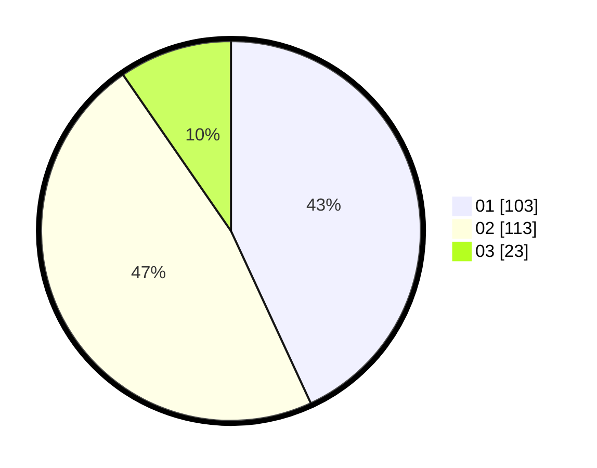

# Hasil

Hasil perolehan suara paslon dapat dilihat pada file paslon-01.txt, paslon-02.txt, dan paslon-03.txt.

Jika tidak ada, artinya data tersebut belum ada pada SIREKAP.

## Perolehan Suara

 * Paslon 01: **103**.
 * Paslon 02: **113**.
 * Paslon 03: **23**.

## Foto C Plano

https://sirekap-obj-formc.kpu.go.id/9cf0/pemilu/ppwp/31/75/06/10/03/3175061003198-20240215-000931--f1f83746-d7aa-42fe-af74-d7380d9503c7.jpg

https://sirekap-obj-formc.kpu.go.id/9cf0/pemilu/ppwp/31/75/06/10/03/3175061003198-20240215-013623--1cb0cb9b-43d7-4d65-bac0-f88b233b0794.jpg

https://sirekap-obj-formc.kpu.go.id/9cf0/pemilu/ppwp/31/75/06/10/03/3175061003198-20240215-011216--6b1ac335-6c7f-4f41-8e5a-c97a2e215b14.jpg
