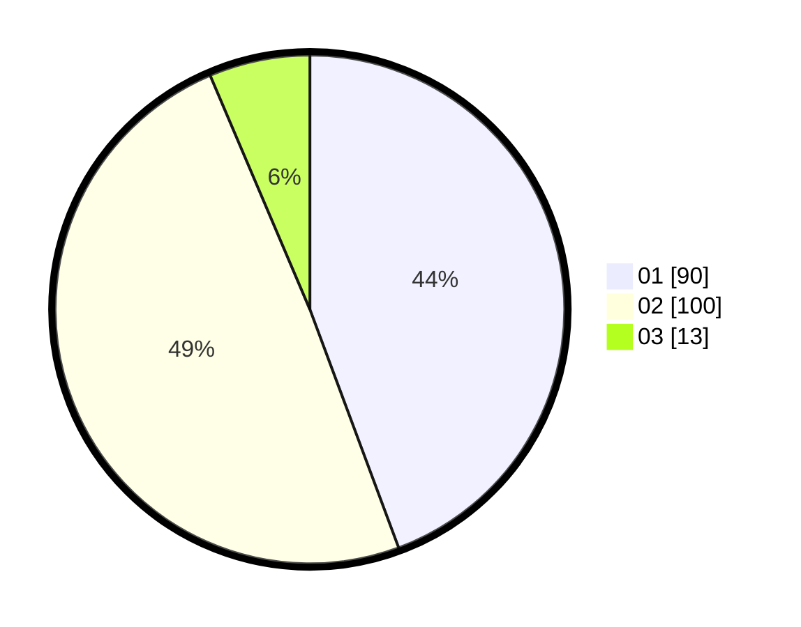

# Hasil

Hasil perolehan suara paslon dapat dilihat pada file paslon-01.txt, paslon-02.txt, dan paslon-03.txt.

Jika tidak ada, artinya data tersebut belum ada pada SIREKAP.

## Perolehan Suara

 * Paslon 01: **90**.
 * Paslon 02: **100**.
 * Paslon 03: **13**.

## Foto C Plano

https://sirekap-obj-formc.kpu.go.id/dbde/pemilu/ppwp/31/75/06/10/03/3175061003202-20240214-184857--a0ba0416-5d59-4eee-83bd-08f88d03b689.jpg

https://sirekap-obj-formc.kpu.go.id/dbde/pemilu/ppwp/31/75/06/10/03/3175061003202-20240214-184907--807b9631-d518-4047-8b7f-6df18e1c02ae.jpg
