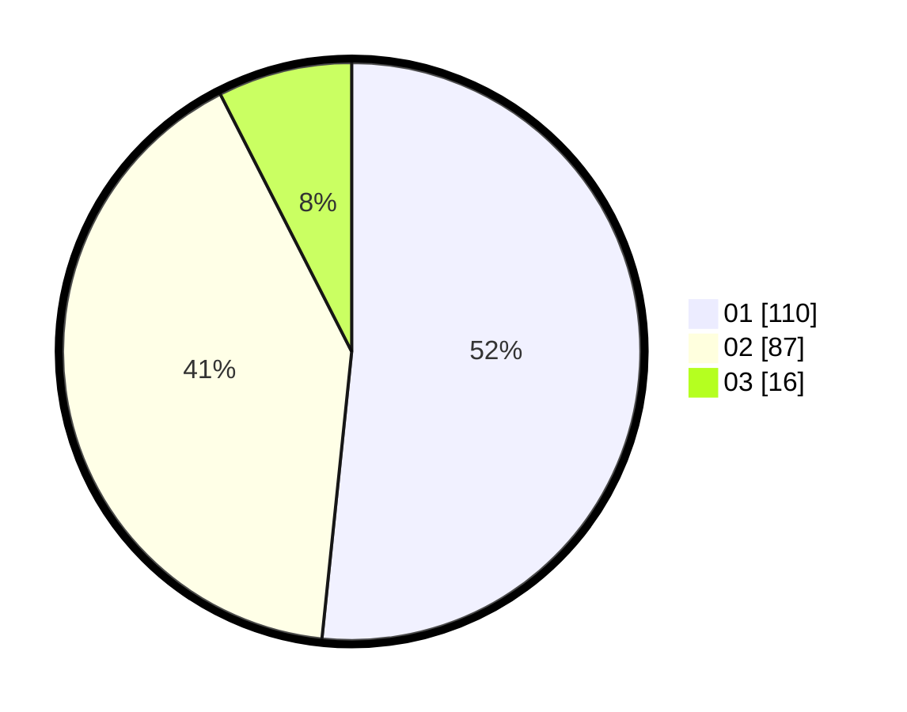

# Hasil

Hasil perolehan suara paslon dapat dilihat pada file paslon-01.txt, paslon-02.txt, dan paslon-03.txt.

Jika tidak ada, artinya data tersebut belum ada pada SIREKAP.

## Perolehan Suara

 * Paslon 01: **110**.
 * Paslon 02: **87**.
 * Paslon 03: **16**.

## Foto C Plano

https://sirekap-obj-formc.kpu.go.id/65d4/pemilu/ppwp/31/75/06/10/03/3175061003204-20240215-185538--29596833-05c7-43f4-b8c6-bb214c7c2895.jpg

https://sirekap-obj-formc.kpu.go.id/65d4/pemilu/ppwp/31/75/06/10/03/3175061003204-20240215-185606--a77a006f-e722-4770-ba05-de7f4e023c89.jpg

https://sirekap-obj-formc.kpu.go.id/65d4/pemilu/ppwp/31/75/06/10/03/3175061003204-20240215-185548--135a3e1a-1d7b-48e2-a298-2a914830a45a.jpg

## DATA PEMILIH TETAP

Jumlah pemilih dalam DPT: **281**.
 * L: **145**.
 * P: **136**.

## DATA PENGGUNA HAK PILIH

Jumlah pengguna hak pilih dalam DPT: **212**.
 * L: **109**.
 * P: **103**.

Jumlah pengguna hak pilih dalam DPTb: **4**.
 * L: **3**.
 * P: **1**.

Jumlah pengguna hak pilih dalam DPK: **0**.
 * L: **0**.
 * P: **0**.

Jumlah pengguna hak pilih: **216**.
 * L: **112**.
 * P: **104**.

## JUMLAH SUARA SAH DAN TIDAK SAH

JUMLAH SELURUH SUARA SAH: **213**.

JUMLAH SUARA TIDAK SAH: **3**.

JUMLAH SELURUH SUARA SAH DAN SUARA TIDAK SAH: **216**.
