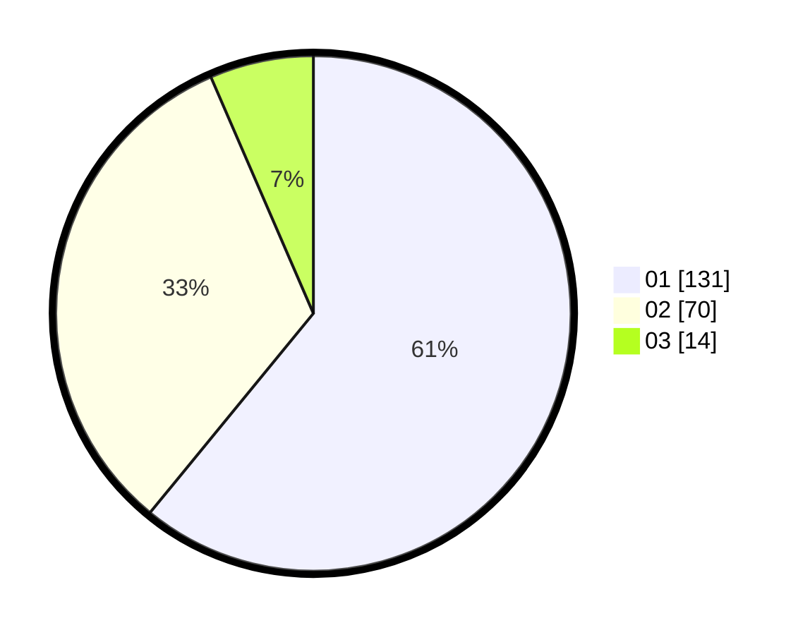

# Hasil

Hasil perolehan suara paslon dapat dilihat pada file paslon-01.txt, paslon-02.txt, dan paslon-03.txt.

Jika tidak ada, artinya data tersebut belum ada pada SIREKAP.

## Perolehan Suara

 * Paslon 01: **131**.
 * Paslon 02: **70**.
 * Paslon 03: **14**.

## Foto C Plano

https://sirekap-obj-formc.kpu.go.id/6cf3/pemilu/ppwp/31/75/06/10/03/3175061003206-20240215-002744--1c20fdd8-3fc4-43bf-9a55-e134a94ce887.jpg

https://sirekap-obj-formc.kpu.go.id/6cf3/pemilu/ppwp/31/75/06/10/03/3175061003206-20240215-010746--a2e2ece5-afa9-4c55-9c86-87c9b2ac65e0.jpg

https://sirekap-obj-formc.kpu.go.id/6cf3/pemilu/ppwp/31/75/06/10/03/3175061003206-20240215-010735--a51e76b1-4d4c-4ffd-825d-8d560f433a6a.jpg

## DATA PEMILIH TETAP

Jumlah pemilih dalam DPT: **276**.
 * L: **138**.
 * P: **138**.

## DATA PENGGUNA HAK PILIH

Jumlah pengguna hak pilih dalam DPT: **216**.
 * L: **106**.
 * P: **110**.

Jumlah pengguna hak pilih dalam DPTb: **0**.
 * L: **0**.
 * P: **0**.

Jumlah pengguna hak pilih dalam DPK: **0**.
 * L: **0**.
 * P: **0**.

Jumlah pengguna hak pilih: **216**.
 * L: **106**.
 * P: **110**.

## JUMLAH SUARA SAH DAN TIDAK SAH

JUMLAH SELURUH SUARA SAH: **215**.

JUMLAH SUARA TIDAK SAH: **1**.

JUMLAH SELURUH SUARA SAH DAN SUARA TIDAK SAH: **216**.
