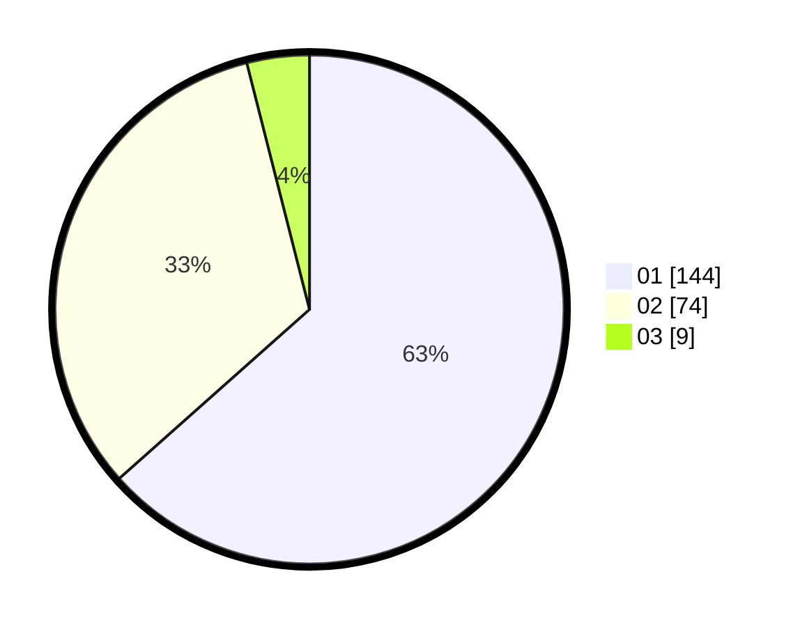

# Hasil

Hasil perolehan suara paslon dapat dilihat pada file paslon-01.txt, paslon-02.txt, dan paslon-03.txt.

Jika tidak ada, artinya data tersebut belum ada pada SIREKAP.

## Perolehan Suara

 * Paslon 01: **144**.
 * Paslon 02: **74**.
 * Paslon 03: **9**.

## Foto C Plano

https://sirekap-obj-formc.kpu.go.id/2452/pemilu/ppwp/31/75/06/10/03/3175061003207-20240217-074920--ae189d50-1c4b-4935-9b31-fd7e112039a3.jpg

https://sirekap-obj-formc.kpu.go.id/2452/pemilu/ppwp/31/75/06/10/03/3175061003207-20240217-074922--e0077686-781d-4925-a874-4d3aab1e7dcf.jpg

https://sirekap-obj-formc.kpu.go.id/2452/pemilu/ppwp/31/75/06/10/03/3175061003207-20240217-074921--0eb9e76f-20d8-4036-9dff-f9092984cec9.jpg

## DATA PEMILIH TETAP

Jumlah pemilih dalam DPT: **272**.
 * L: **143**.
 * P: **129**.

## DATA PENGGUNA HAK PILIH

Jumlah pengguna hak pilih dalam DPT: **225**.
 * L: **109**.
 * P: **116**.

Jumlah pengguna hak pilih dalam DPTb: **0**.
 * L: **0**.
 * P: **0**.

Jumlah pengguna hak pilih dalam DPK: **2**.
 * L: **2**.
 * P: **0**.

Jumlah pengguna hak pilih: **227**.
 * L: **111**.
 * P: **116**.

## JUMLAH SUARA SAH DAN TIDAK SAH

JUMLAH SELURUH SUARA SAH: **227**.

JUMLAH SUARA TIDAK SAH: **0**.

JUMLAH SELURUH SUARA SAH DAN SUARA TIDAK SAH: **227**.
