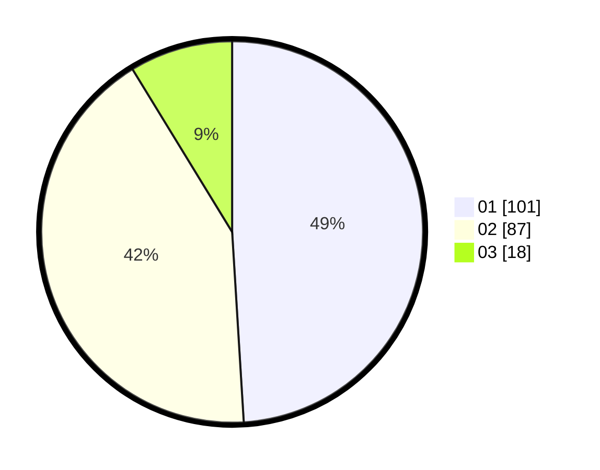

# Hasil

Hasil perolehan suara paslon dapat dilihat pada file paslon-01.txt, paslon-02.txt, dan paslon-03.txt.

Jika tidak ada, artinya data tersebut belum ada pada SIREKAP.

## Perolehan Suara

 * Paslon 01: **101**.
 * Paslon 02: **87**.
 * Paslon 03: **18**.

## Foto C Plano

https://sirekap-obj-formc.kpu.go.id/ed24/pemilu/ppwp/31/75/06/10/03/3175061003211-20240214-235849--0df15d26-29ac-480a-8457-07a471499b2f.jpg

https://sirekap-obj-formc.kpu.go.id/ed24/pemilu/ppwp/31/75/06/10/03/3175061003211-20240215-000021--82a55e88-bb23-4b5d-926e-8896ff605adf.jpg

https://sirekap-obj-formc.kpu.go.id/ed24/pemilu/ppwp/31/75/06/10/03/3175061003211-20240215-000054--1b9dd841-1e69-4f74-a1ec-4487cfab8836.jpg
