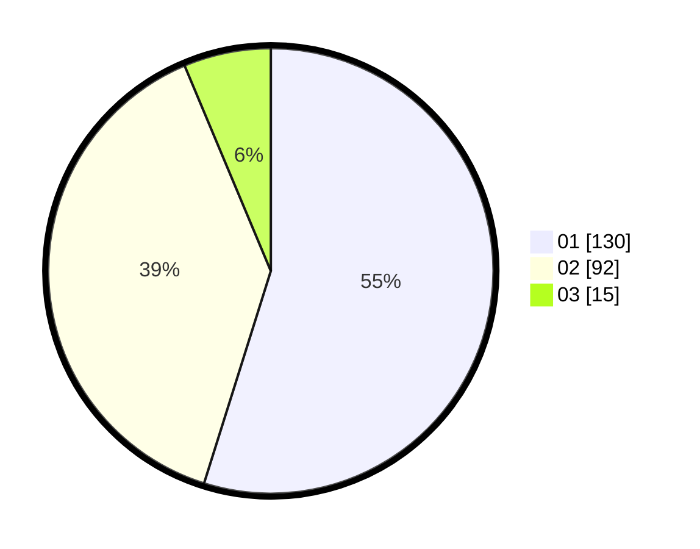

# Hasil

Hasil perolehan suara paslon dapat dilihat pada file paslon-01.txt, paslon-02.txt, dan paslon-03.txt.

Jika tidak ada, artinya data tersebut belum ada pada SIREKAP.

## Perolehan Suara

 * Paslon 01: **130**.
 * Paslon 02: **92**.
 * Paslon 03: **15**.

## Foto C Plano

https://sirekap-obj-formc.kpu.go.id/5018/pemilu/ppwp/31/75/06/10/03/3175061003213-20240216-135615--a05dceae-8dcd-4a7d-b806-bc947fc1a274.jpg

https://sirekap-obj-formc.kpu.go.id/5018/pemilu/ppwp/31/75/06/10/03/3175061003213-20240214-195106--55c390e3-1dc3-4246-bfeb-03f333ed5b57.jpg

https://sirekap-obj-formc.kpu.go.id/5018/pemilu/ppwp/31/75/06/10/03/3175061003213-20240214-195723--86dea66b-600e-446c-a411-e1aaf5e6b231.jpg

## DATA PEMILIH TETAP

Jumlah pemilih dalam DPT: **281**.
 * L: **139**.
 * P: **142**.

## DATA PENGGUNA HAK PILIH

Jumlah pengguna hak pilih dalam DPT: **237**.
 * L: **114**.
 * P: **123**.

Jumlah pengguna hak pilih dalam DPTb: **3**.
 * L: **0**.
 * P: **3**.

Jumlah pengguna hak pilih dalam DPK: **0**.
 * L: **0**.
 * P: **0**.

Jumlah pengguna hak pilih: **240**.
 * L: **114**.
 * P: **126**.

## JUMLAH SUARA SAH DAN TIDAK SAH

JUMLAH SELURUH SUARA SAH: **237**.

JUMLAH SUARA TIDAK SAH: **3**.

JUMLAH SELURUH SUARA SAH DAN SUARA TIDAK SAH: **240**.
