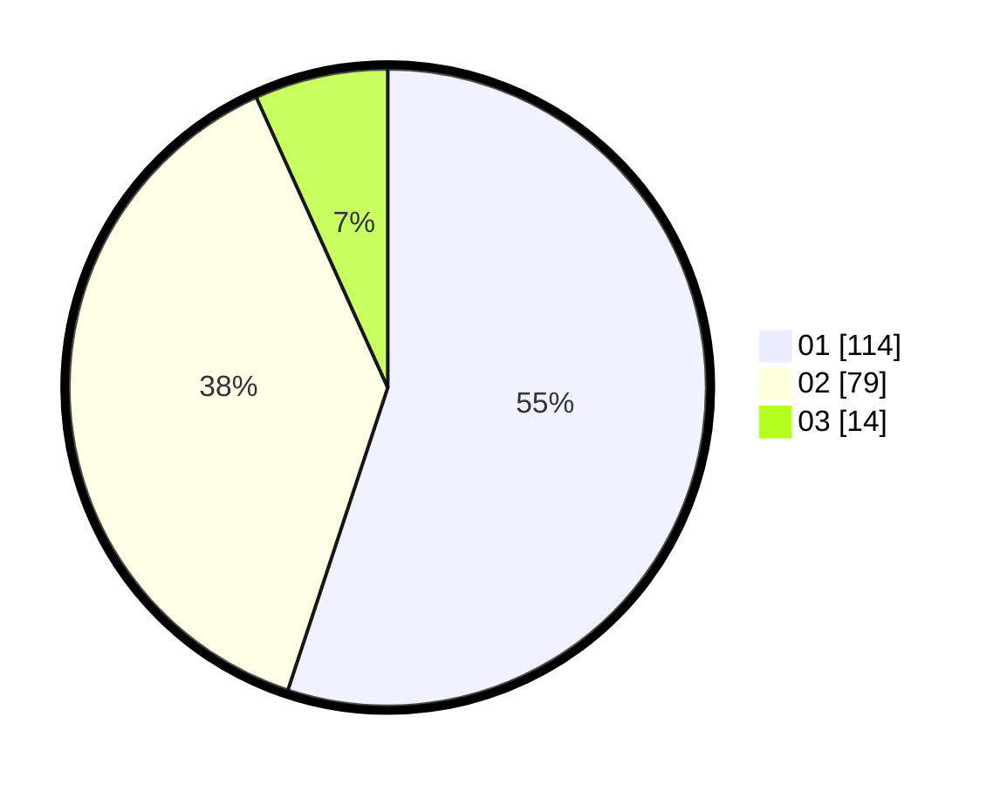

# Hasil

Hasil perolehan suara paslon dapat dilihat pada file paslon-01.txt, paslon-02.txt, dan paslon-03.txt.

Jika tidak ada, artinya data tersebut belum ada pada SIREKAP.

## Perolehan Suara

 * Paslon 01: **114**.
 * Paslon 02: **79**.
 * Paslon 03: **14**.

## Foto C Plano

https://sirekap-obj-formc.kpu.go.id/117c/pemilu/ppwp/31/75/06/10/03/3175061003214-20240216-032656--3a5593f2-cca6-42d6-9169-8bd3a5329c80.jpg

https://sirekap-obj-formc.kpu.go.id/117c/pemilu/ppwp/31/75/06/10/03/3175061003214-20240216-032714--4ae82d1d-afbb-4d51-b833-5ccd0be47fba.jpg

https://sirekap-obj-formc.kpu.go.id/117c/pemilu/ppwp/31/75/06/10/03/3175061003214-20240216-032706--4913a462-ce6a-4516-9ab3-3b0e7ec3dbff.jpg

## DATA PEMILIH TETAP

Jumlah pemilih dalam DPT: **208**.
 * L: **96**.
 * P: **112**.

## DATA PENGGUNA HAK PILIH

Jumlah pengguna hak pilih dalam DPT: **208**.
 * L: **96**.
 * P: **112**.

Jumlah pengguna hak pilih dalam DPTb: **2**.
 * L: **1**.
 * P: **1**.

Jumlah pengguna hak pilih dalam DPK: **1**.
 * L: **1**.
 * P: **0**.

Jumlah pengguna hak pilih: **211**.
 * L: **98**.
 * P: **113**.

## JUMLAH SUARA SAH DAN TIDAK SAH

JUMLAH SELURUH SUARA SAH: **207**.

JUMLAH SUARA TIDAK SAH: **4**.

JUMLAH SELURUH SUARA SAH DAN SUARA TIDAK SAH: **211**.
