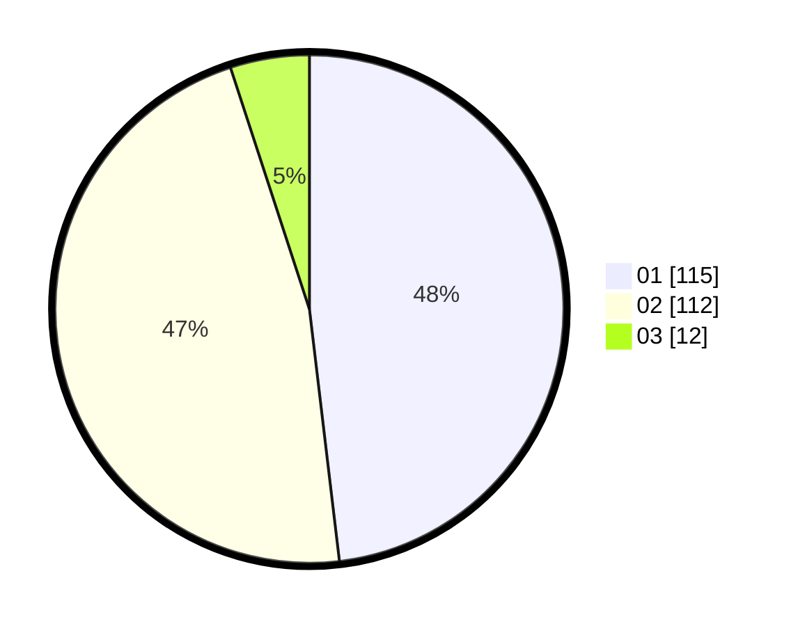

# Hasil

Hasil perolehan suara paslon dapat dilihat pada file paslon-01.txt, paslon-02.txt, dan paslon-03.txt.

Jika tidak ada, artinya data tersebut belum ada pada SIREKAP.

## Perolehan Suara

 * Paslon 01: **115**.
 * Paslon 02: **112**.
 * Paslon 03: **12**.

## Foto C Plano

https://sirekap-obj-formc.kpu.go.id/0cda/pemilu/ppwp/31/75/06/10/03/3175061003219-20240214-193148--2793763c-5d74-449e-ac86-0243a313b37d.jpg

https://sirekap-obj-formc.kpu.go.id/0cda/pemilu/ppwp/31/75/06/10/03/3175061003219-20240214-191052--f4cd495d-e0c0-438c-ad6a-7e26276a9f87.jpg

https://sirekap-obj-formc.kpu.go.id/0cda/pemilu/ppwp/31/75/06/10/03/3175061003219-20240214-191105--9ca09f97-fc93-4336-b92c-3cea7a35b856.jpg

## DATA PEMILIH TETAP

Jumlah pemilih dalam DPT: **285**.
 * L: **139**.
 * P: **146**.

## DATA PENGGUNA HAK PILIH

Jumlah pengguna hak pilih dalam DPT: **239**.
 * L: **118**.
 * P: **121**.

Jumlah pengguna hak pilih dalam DPTb: **0**.
 * L: **0**.
 * P: **0**.

Jumlah pengguna hak pilih dalam DPK: **0**.
 * L: **0**.
 * P: **0**.

Jumlah pengguna hak pilih: **239**.
 * L: **118**.
 * P: **121**.

## JUMLAH SUARA SAH DAN TIDAK SAH

JUMLAH SELURUH SUARA SAH: **239**.

JUMLAH SUARA TIDAK SAH: **0**.

JUMLAH SELURUH SUARA SAH DAN SUARA TIDAK SAH: **239**.
