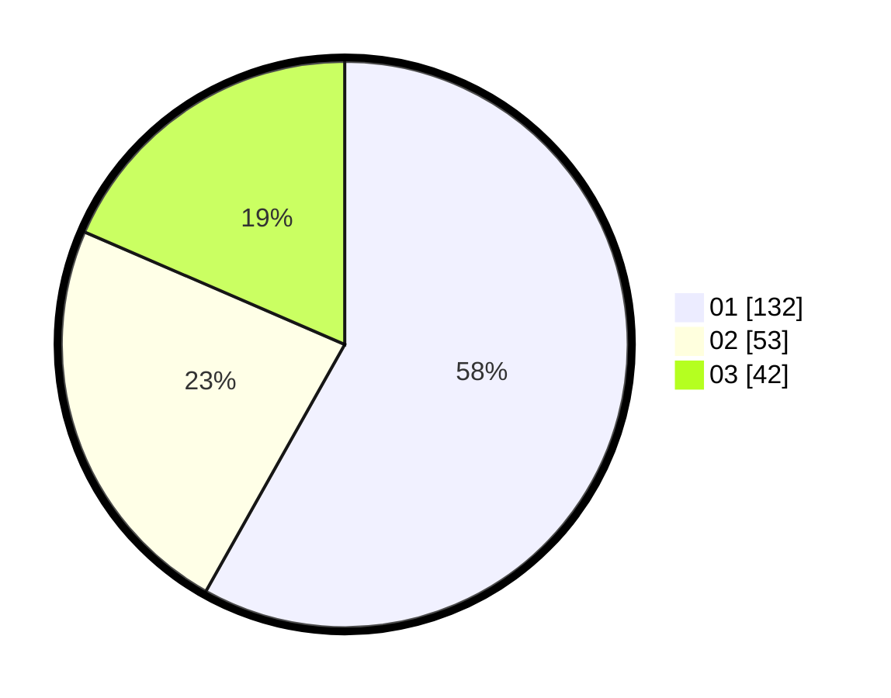

# Hasil

Hasil perolehan suara paslon dapat dilihat pada file paslon-01.txt, paslon-02.txt, dan paslon-03.txt.

Jika tidak ada, artinya data tersebut belum ada pada SIREKAP.

## Perolehan Suara

 * Paslon 01: **132**.
 * Paslon 02: **53**.
 * Paslon 03: **42**.

## Foto C Plano

https://sirekap-obj-formc.kpu.go.id/d560/pemilu/ppwp/31/75/06/10/03/3175061003220-20240216-122134--79da8a8a-22e4-4cdf-bf85-ab161d3e8553.jpg

https://sirekap-obj-formc.kpu.go.id/d560/pemilu/ppwp/31/75/06/10/03/3175061003220-20240216-122311--748579c8-75ba-49f4-919e-8a97adba756b.jpg

https://sirekap-obj-formc.kpu.go.id/d560/pemilu/ppwp/31/75/06/10/03/3175061003220-20240216-122502--a8dd50dd-e984-4332-b772-8ad7061f62dd.jpg
