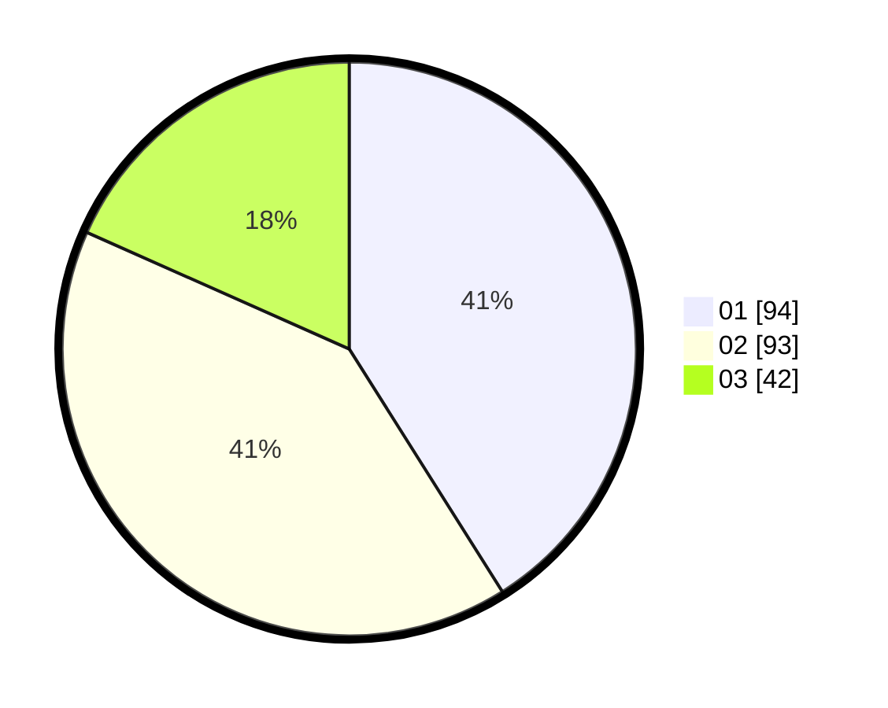

# Hasil

Hasil perolehan suara paslon dapat dilihat pada file paslon-01.txt, paslon-02.txt, dan paslon-03.txt.

Jika tidak ada, artinya data tersebut belum ada pada SIREKAP.

## Perolehan Suara

 * Paslon 01: **94**.
 * Paslon 02: **93**.
 * Paslon 03: **42**.

## Foto C Plano

https://sirekap-obj-formc.kpu.go.id/9a6d/pemilu/ppwp/31/75/06/10/03/3175061003223-20240214-212924--02507fb7-30a4-4fab-b087-05fe537f4abe.jpg

https://sirekap-obj-formc.kpu.go.id/9a6d/pemilu/ppwp/31/75/06/10/03/3175061003223-20240214-204221--1de9416d-d95e-4946-9186-cec6f82d403e.jpg

https://sirekap-obj-formc.kpu.go.id/9a6d/pemilu/ppwp/31/75/06/10/03/3175061003223-20240214-211719--86154b5f-a1a2-44a1-8d25-cf5c9e494828.jpg

## DATA PEMILIH TETAP

Jumlah pemilih dalam DPT: **281**.
 * L: **127**.
 * P: **154**.

## DATA PENGGUNA HAK PILIH

Jumlah pengguna hak pilih dalam DPT: **228**.
 * L: **103**.
 * P: **125**.

Jumlah pengguna hak pilih dalam DPTb: **2**.
 * L: **1**.
 * P: **1**.

Jumlah pengguna hak pilih dalam DPK: **2**.
 * L: **1**.
 * P: **1**.

Jumlah pengguna hak pilih: **232**.
 * L: **105**.
 * P: **127**.

## JUMLAH SUARA SAH DAN TIDAK SAH

JUMLAH SELURUH SUARA SAH: **229**.

JUMLAH SUARA TIDAK SAH: **3**.

JUMLAH SELURUH SUARA SAH DAN SUARA TIDAK SAH: **232**.
