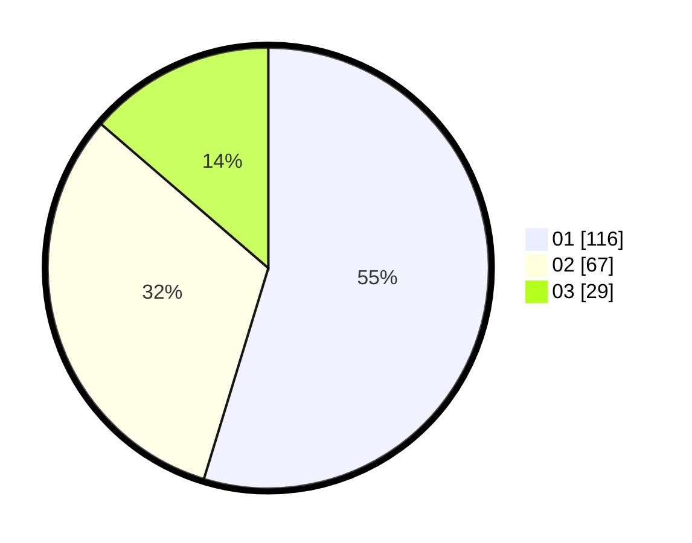

# Hasil

Hasil perolehan suara paslon dapat dilihat pada file paslon-01.txt, paslon-02.txt, dan paslon-03.txt.

Jika tidak ada, artinya data tersebut belum ada pada SIREKAP.

## Perolehan Suara

 * Paslon 01: **116**.
 * Paslon 02: **67**.
 * Paslon 03: **29**.

## Foto C Plano

https://sirekap-obj-formc.kpu.go.id/ab58/pemilu/ppwp/31/75/06/10/03/3175061003226-20240214-155233--f531ddc6-8d9c-4685-9a2c-9470054d422d.jpg

https://sirekap-obj-formc.kpu.go.id/ab58/pemilu/ppwp/31/75/06/10/03/3175061003226-20240214-155407--fa113003-ba90-4acc-b968-dc6381fddff9.jpg

https://sirekap-obj-formc.kpu.go.id/ab58/pemilu/ppwp/31/75/06/10/03/3175061003226-20240214-155920--c15e75a9-f307-4160-a8fd-e59123bfde14.jpg

## DATA PEMILIH TETAP

Jumlah pemilih dalam DPT: **260**.
 * L: **125**.
 * P: **135**.

## DATA PENGGUNA HAK PILIH

Jumlah pengguna hak pilih dalam DPT: **212**.
 * L: **100**.
 * P: **112**.

Jumlah pengguna hak pilih dalam DPTb: **0**.
 * L: **0**.
 * P: **0**.

Jumlah pengguna hak pilih dalam DPK: **2**.
 * L: **0**.
 * P: **2**.

Jumlah pengguna hak pilih: **214**.
 * L: **100**.
 * P: **114**.

## JUMLAH SUARA SAH DAN TIDAK SAH

JUMLAH SELURUH SUARA SAH: **212**.

JUMLAH SUARA TIDAK SAH: **2**.

JUMLAH SELURUH SUARA SAH DAN SUARA TIDAK SAH: **214**.
