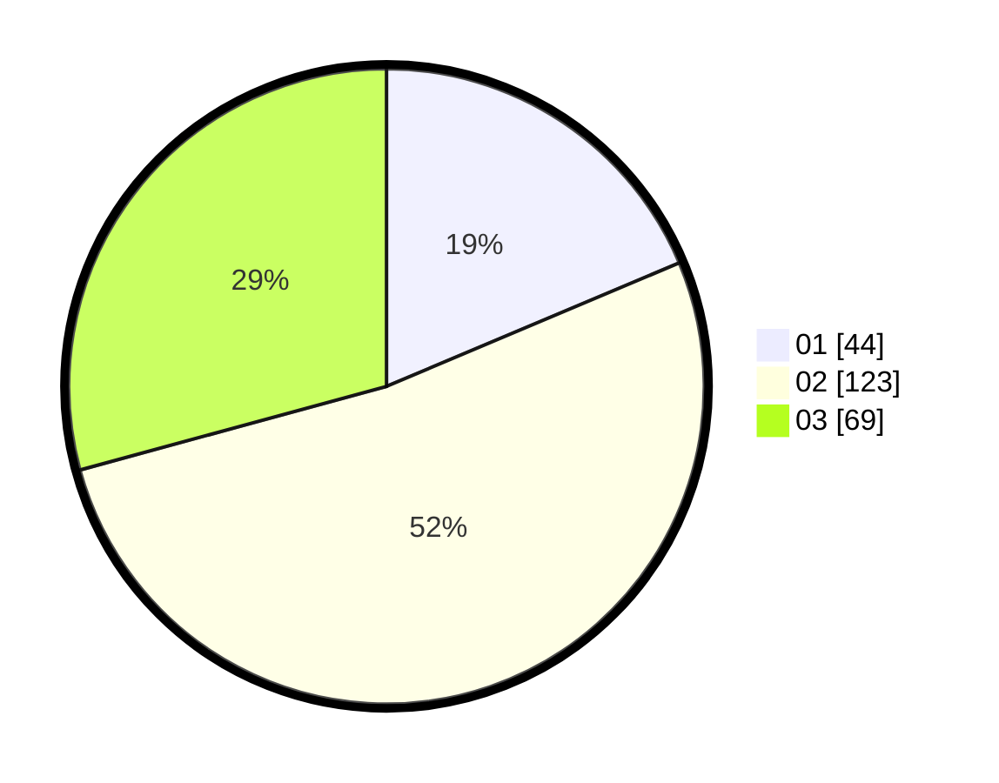

# Hasil

Hasil perolehan suara paslon dapat dilihat pada file paslon-01.txt, paslon-02.txt, dan paslon-03.txt.

Jika tidak ada, artinya data tersebut belum ada pada SIREKAP.

## Perolehan Suara

 * Paslon 01: **44**.
 * Paslon 02: **123**.
 * Paslon 03: **69**.

## Foto C Plano

https://sirekap-obj-formc.kpu.go.id/8db8/pemilu/ppwp/31/75/06/10/03/3175061003229-20240214-155925--d0ce7b00-173c-47b8-8882-8f0366aa6f52.jpg

https://sirekap-obj-formc.kpu.go.id/8db8/pemilu/ppwp/31/75/06/10/03/3175061003229-20240214-160136--38a56172-0b01-4e63-a763-9b9230d7c8ef.jpg

https://sirekap-obj-formc.kpu.go.id/8db8/pemilu/ppwp/31/75/06/10/03/3175061003229-20240214-155718--5b497fd7-89b8-4cd1-88b4-5748dc3052b8.jpg

## DATA PEMILIH TETAP

Jumlah pemilih dalam DPT: **300**.
 * L: **159**.
 * P: **141**.

## DATA PENGGUNA HAK PILIH

Jumlah pengguna hak pilih dalam DPT: **231**.
 * L: **115**.
 * P: **116**.

Jumlah pengguna hak pilih dalam DPTb: **0**.
 * L: **0**.
 * P: **0**.

Jumlah pengguna hak pilih dalam DPK: **8**.
 * L: **3**.
 * P: **5**.

Jumlah pengguna hak pilih: **239**.
 * L: **118**.
 * P: **121**.

## JUMLAH SUARA SAH DAN TIDAK SAH

JUMLAH SELURUH SUARA SAH: **236**.

JUMLAH SUARA TIDAK SAH: **3**.

JUMLAH SELURUH SUARA SAH DAN SUARA TIDAK SAH: **239**.
