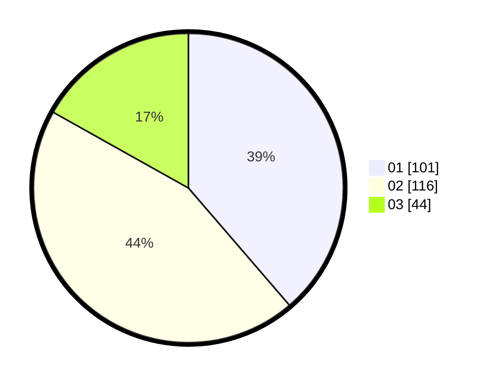

# Hasil

Hasil perolehan suara paslon dapat dilihat pada file paslon-01.txt, paslon-02.txt, dan paslon-03.txt.

Jika tidak ada, artinya data tersebut belum ada pada SIREKAP.

## Perolehan Suara

 * Paslon 01: **101**.
 * Paslon 02: **116**.
 * Paslon 03: **44**.

## Foto C Plano

https://sirekap-obj-formc.kpu.go.id/b696/pemilu/ppwp/31/75/06/10/03/3175061003231-20240214-223123--edaed65b-743a-43bf-8bc0-10f4fa0c6d97.jpg

https://sirekap-obj-formc.kpu.go.id/b696/pemilu/ppwp/31/75/06/10/03/3175061003231-20240214-223211--5b8ff5d7-edd2-4c85-886c-e6ecd4258a34.jpg

https://sirekap-obj-formc.kpu.go.id/b696/pemilu/ppwp/31/75/06/10/03/3175061003231-20240214-223245--d07b3c21-76d1-4567-bbc3-f4b9eb3b3659.jpg
