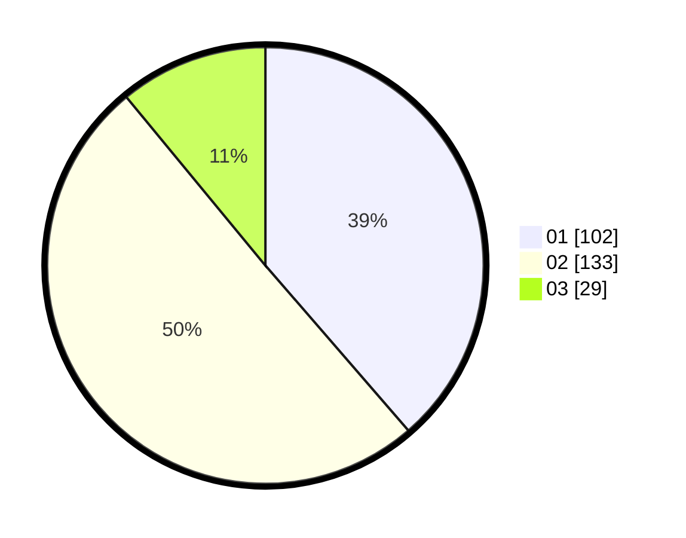

# Hasil

Hasil perolehan suara paslon dapat dilihat pada file paslon-01.txt, paslon-02.txt, dan paslon-03.txt.

Jika tidak ada, artinya data tersebut belum ada pada SIREKAP.

## Perolehan Suara

 * Paslon 01: **102**.
 * Paslon 02: **133**.
 * Paslon 03: **29**.

## Foto C Plano

https://sirekap-obj-formc.kpu.go.id/6797/pemilu/ppwp/31/75/06/10/03/3175061003233-20240214-203348--dc1fcd2c-ad1d-45da-845a-e1985ded389c.jpg

https://sirekap-obj-formc.kpu.go.id/6797/pemilu/ppwp/31/75/06/10/03/3175061003233-20240214-203504--040d3765-fc44-4f29-9274-2c7647de1610.jpg

https://sirekap-obj-formc.kpu.go.id/6797/pemilu/ppwp/31/75/06/10/03/3175061003233-20240214-203551--802e5967-219a-42db-9583-789192b9b1c0.jpg

## DATA PEMILIH TETAP

Jumlah pemilih dalam DPT: **295**.
 * L: **135**.
 * P: **160**.

## DATA PENGGUNA HAK PILIH

Jumlah pengguna hak pilih dalam DPT: **263**.
 * L: **119**.
 * P: **144**.

Jumlah pengguna hak pilih dalam DPTb: **3**.
 * L: **1**.
 * P: **2**.

Jumlah pengguna hak pilih dalam DPK: **2**.
 * L: **1**.
 * P: **1**.

Jumlah pengguna hak pilih: **268**.
 * L: **121**.
 * P: **147**.

## JUMLAH SUARA SAH DAN TIDAK SAH

JUMLAH SELURUH SUARA SAH: **264**.

JUMLAH SUARA TIDAK SAH: **4**.

JUMLAH SELURUH SUARA SAH DAN SUARA TIDAK SAH: **268**.
